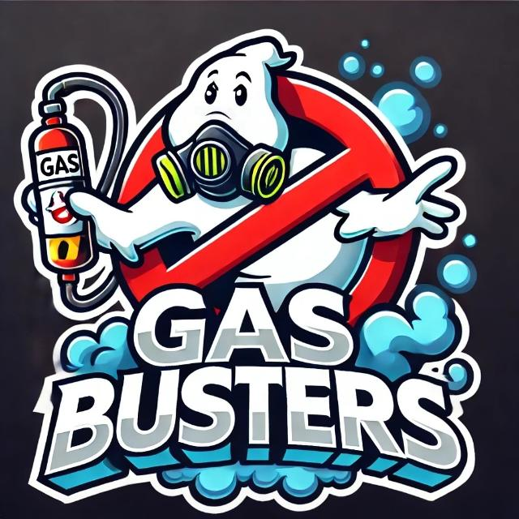
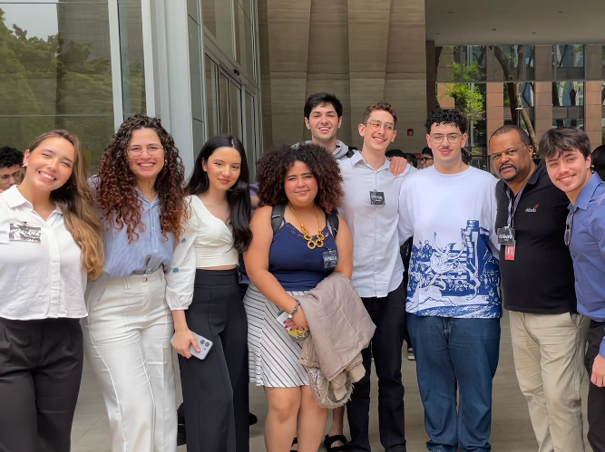

# Inteli - Instituto de Tecnologia e Liderança 

<p align="center">
<a href= "https://www.inteli.edu.br/"></a>
</p>

# Modelo Preditivo de Gás - COMPASS

## GasBusters

<div align="center" width="100%">
 <sub>Figura 1: Logo da equipe GasBusters </sub><br>


<sup>Fonte: Material criado pelos desenvolvedores (2024)</sup> </div>

## Integrantes: 
- <a href="https://www.linkedin.com/in/giacomo-zema-matizonkas-7ab9072b2/">Giacomo Zema </a>
- <a href="https://www.linkedin.com/in/heitorfariacandido/">Heitor Cândido </a>
- <a href="https://www.linkedin.com/in/ian-pereira-simao/">Ian Simão </a> 
- <a href="https://www.linkedin.com/in/iisabelledantas/">Isabelle Dantas</a> 
- <a href="https://www.linkedin.com/in/marianadepaulabarbosa/">Mariana de Paula </a>
- <a href="https://www.linkedin.com/in/matheusfgs/">Matheus Fernandes </a> 
- <a href="https://www.linkedin.com/in/rafaela-s-o-lima/">Rafaela Silva</a>
- <a href="https://www.linkedin.com/in/yasmim-passos/">Yasmim Passos</a>

<div align="center" width="100%">
 <sub>Figura 2: Imagem dos integrantes da equipe </sub><br>
 </div>

## Professores:
### Orientador(a) 
- <a href="https://www.linkedin.com/in/claudio-andr%C3%A9-64911a1b5/">Claudio André</a>
### Instrutores
- <a href="https://www.linkedin.com/in/rafael-will-m-de-araujo-20809b18b/">Rafael Will</a>
- <a href="https://www.linkedin.com/in/henrique-mohallem-paiva-6854b460/">Henrique Mohallem</a> 
- <a href="https://www.linkedin.com/in/francisco-escobar/">Francisco Escobar</a> 
- <a href="https://www.linkedin.com/in/michele-bazana-de-souza-69b77763/">Michele Bazana</a>
- <a href="https://www.linkedin.com/in/diogo-martins-gon%C3%A7alves-de-morais-96404732/">Diogo Martins</a> 


## 📝 Descrição

O projeto da equipe Gasbusters do INTELI, além de detectar fraudes no consumo de gás natural, também tem como objetivo identificar padrões de consumo e prever gastos. A criação de um modelo preditivo, com o uso de técnicas de inteligência artificial, é uma resposta à demanda da Compass Gás e Energia SA, que busca otimizar suas operações.

Um dos principais desafios enfrentados no desenvolvimento do modelo é o baixo nível de detalhamento dos dados disponíveis. Isso significa que o modelo precisa trabalhar com informações limitadas, o que torna ainda mais relevante a capacidade de análise avançada e preditiva do sistema. Mesmo com essas limitações, o modelo deve ser capaz de reconhecer tendências de consumo ao longo do tempo e fornecer previsões sobre os gastos futuros dos clientes, oferecendo insights valiosos tanto para otimização de recursos quanto para planejamento estratégico.

Dessa forma, além de ajudar a Compass a prevenir fraudes, o modelo preditivo auxiliará na gestão eficiente da demanda, permitindo à empresa não só identificar irregularidades, mas também prever picos de consumo, melhorando o atendimento ao cliente e contribuindo para uma gestão mais sustentável e econômica da distribuição de gás natural.

<b>Link para vídeo demonstrativo:</b> <a href="https://www.youtube.com/watch?v=Q__hkM0E6C4">Clique Aqui!</a>

## 📁 Estrutura de pastas

Dentre os arquivos presentes na raiz do projeto, definem-se:

- <b>readme.md</b>: Arquivo que serve como guia e explicação geral sobre o projeto (o mesmo que você está lendo agora).

- <b>assets</b>: Todas as imagens e mídias utilizadas nos notebooks e documentação são posicionadas aqui.

- <b>documents</b>: Aqui estarão todos os documentos do projeto. Há também uma pasta denominada <b>extras</b> onde estão presentes documentos complementares.

- <b>notebooks</b>: Todos os Jupyter Notebooks criados para desenvolvimento do projeto.

- <b>.gitattributes</b>: Esse arquivo serve para detectar automaticamente arquivos de texto e normalizá-los.

- <b>.gitignore</b>: Arquivo destinado para que certos tipos de arquivo <b>(.csv, .xls, .xlsx
.tsv, .db, .sql)</b> não sejam transportados para nuvem e outros meios on-line, a fim de assegurar itegridade dos dados obtidos e tratados. 


## 💻 Execução dos projetos

### Sistema Operacional
O modelo foi testado e pode ser executado em:

>Windows 10 ou superior macOS 10.15+

>Distribuições Linux como Ubuntu ou CentOS

### Linguagem de Programação
Este projeto foi desenvolvido em <b>Python 3.8 ou superior</b>. Certifique-se de ter uma versão compatível instalada.

### Bibliotecas e Pacotes
As principais dependências do projeto estão listadas no arquivo requirements.txt. Para instalar todos os pacotes necessários, basta executar o comando abaixo em seu terminal:

```bash
pip install -r requirements.txt
```
<b> Os pacotes essenciais incluem:</b>

* <b>numpy:</b> Para manipulação numérica;
* <b>pandas:</b> Para análise e manipulação de dados;
* <b>scikit-learn:</b> Para implementação dos algoritmos variados de machine learning;
* <b>matplotlib e seaborn:</b> Para visualizações e gráficos;
* <b>category encoders:</b> Para categorização e normalização dos dados.

### Leitura dos Dados 
No caso do projeto, o _dataframe_ está sendo importado e utilizado como arquivo **.cvs** e esse mesmo formato está inserido no arquivo **.gitignore**. Por esse fator, a base de dados não estará disponível no _github_ e deverá ser importada em sua máquina local.

### Ambiente Virtual (Recomendado)
Recomendamos a utilização de um ambiente virtual para isolar as dependências do projeto. Para criar e ativar um ambiente virtual, utilize os comandos abaixo:
```bash
python -m venv venv
source venv/bin/activate  #Linux/macOS
.\venv\Scripts\activate   #Windows
```

### IDE
Recomendamos a utilização do _vscode_ para visualização do código e a instalação das seguintes extensões:

* Jupyter: É um ambiente de desenvolvimento Python  Se um desenvolvedor quer visualizar um gráfico ou fórmula, ele digita o comando desejado na célula correspondente. Essa ação economiza tempo e ajuda a evitar erros.
* Python: Necessário para compreender a linguagem do código referido.

### Ordem dos Notebooks

#### 1. Detecção de Anomalias
- **1º: `exploracaoDeDados.ipynb`**  
  Realiza a exploração inicial dos dados e seu pré-processamento, permitindo entender as características e padrões.

- **2º: `previsaoCluster.ipynb`**  
  Utiliza os dados explorados para prever e identificar clusters e anomalias.

**Obs:** Se você deseja apenas executar o modelo sem revisar seu processo de geração, pode usar diretamente o notebook `anomalias.ipynb`.


#### 2. Previsão de Gastos
- **1º: `preparacaoDadosPreditivos.ipynb`**  
  Prepara os dados para modelagem preditiva, garantindo que estejam no formato correto.

- **2º: `ModelosPreditivoConsumo.ipynb`**  
  Implementa modelos preditivos para estimar o consumo, utilizando os dados preparados.

## 🗃 Histórico de lançamentos

* 1.0.0 - 11/10/2024
    * [sprint 5] Lançamento da primeira versão do modelo preditivo com documentação.
* 0.6.0 - 27/09/2024
    * [sprint 4] Comparação de modelos preditivos
* 0.3.1 - 13/09/2024
    * [sprint 3] Preparação de dados e modelo preditivo preliminar
* 0.2.7 - 30/08/2024
    * [sprint 2] Análise exploratória e levantamento de hipóteses
* 0.1.3 - 16/08/2024
    * [sprint 1] Documentação de entendimento do negócio

## 📋 Licença/License

<p xmlns:cc="http://creativecommons.org/ns#" xmlns:dct="http://purl.org/dc/terms/"><a property="dct:title" rel="cc:attributionURL" href="https://github.dev/Intelihub/Template_M3">GASBUSTERS</a> by Inteli is licensed under <a href="http://creativecommons.org/licenses/by/4.0/?ref=chooser-v1" target="_blank" rel="license noopener noreferrer" style="display:inline-block;">Attribution 4.0 International</a>.</p>