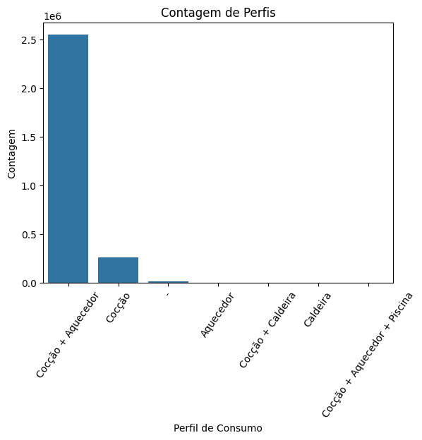

# Documentação Modelo Preditivo - Inteli


## Gás Busters - Modelo Preditivo

### Gás Busters


#### Giacomo Zema, Heitor Candido, Ian Pereira, Isabelle Dantas, Matheus Souza, Mariana de Paula, Rafaela Silva e Yasmim Passos.

## Sumário

[1. Introdução](#1-introdução)

[2. Objetivos e Justificativa](#2-objetivos-e-justificativa)

[3. Metodologia](#3-metodologia)

[4. Desenvolvimento e Resultados](#4-desenvolvimento-e-resultados)

[5. Conclusões e Recomendações](#5-conclusões-e-recomendações)

[6. Referências](#6-referências)

[Anexos](#anexos)

## <a name="c1"></a>1. Introdução

&nbsp;&nbsp;&nbsp;&nbsp; A [**_COMPASS_ GAS E ENERGIA SA**](#6-referências)  é uma empresa de grande porte localizada no Brasil, atuando no setor de energia. Com uma posição consolidada no mercado, ela se destaca por sua inovação e compromisso com a sustentabilidade e eficiência energética. A empresa está envolvida em várias áreas dentro do setor energético, incluindo a distribuição de gás natural e a implementação de soluções tecnológicas para otimizar o uso de recursos energéticos.

&nbsp;&nbsp;&nbsp;&nbsp; O problema a ser abordado neste projeto está relacionado à necessidade de identificar anomalias associadas a fraudes no consumo de gás natural. As fraudes representam não apenas perdas financeiras significativas, mas também riscos à segurança e à confiabilidade do fornecimento. Este projeto visa desenvolver um modelo preditivo que possa detectar padrões suspeitos e comportamentos atípicos no consumo de gás.

&nbsp;&nbsp;&nbsp;&nbsp; Neste sentido, a problemática apresentada pela empresa evidencia a necessidade de prevenir problemas e monitorar o consumo de cada cliente final e distribuidora. A [**_Compass_**](#6-referências) e a **_IOLIT_**,  em parceria com o **Inteli** (Instituto de Tecnologia e Liderança), têm o objetivo de desenvolver um modelo preditivo para prever anomalias e problemas na rede de distribuição.

&nbsp;&nbsp;&nbsp;&nbsp; Por fim, tais modelos permitiriam uma maior taxa de detecção para a empresa. Pois, a verificação de anomalias, por se tratar da análise de uma massa muito grande de dados, é difícil de ser feita manualmente. Assim, os modelos de predição trariam uma verificação muito melhor das possíveis anomalias.


## <a name="c2"></a>2. Objetivos e Justificativa
### 2.1 Objetivos

&nbsp;&nbsp;&nbsp;&nbsp;  O presente projeto tem o objetivo de oferecer ao parceiro de negócios, com base nos dados oferecidos pela Compass, uma solução que possibilite detectar as anomalias e padrões de fraude no processo de fornecimento de gás natural. Dessa forma, melhorando a segurança operacional e a gestão de riscos, além de criar oportunidades de vendas de serviços relacionados ao fornecimento de energia.

&nbsp;&nbsp;&nbsp;&nbsp;Além disso, os objetivos específicos são:

* **Detecção de anomalias:** Um modelo capaz de identificar atividades e comportamentos anormais;
* **Identificação de fraudes:** Conseguir detectar padrões de fraudes com uma acurácia razoável, assegurando a integridade da empresa;
* **Geração de Insights:** Fornecer análises para os clientes, seja distribuidora de gás, condomínios ou usuários finais, com base no tratamento dos dados, promovendo a transparência entre a Compass e seus clientes.


### 2.2 Proposta de solução

&nbsp;&nbsp;&nbsp;&nbsp; A proposta de solução é a elaboração de um modelo preditivo desenvolvido com *Machine Learning*, *Python* e as bibliotecas *Pandas*, *NumPy*, *Seaborn* e *Matplotlib*. Nesse sentido, esse modelo será treinado com os dados fornecidos pela *Compass* para analisar dados de consumo de gás e identificar os possíveis padrões das anomalias. Dessa maneira, pode indicar possíveis fraudes ou problemas na infraestrutura da distribuidora de gás, como nas tubulações ou nos medidores.  

&nbsp;&nbsp;&nbsp;&nbsp; Seguindo por essa lógica, o modelo preditivo da equipe *Gas Busters* consiste no desenvolvimento de um *dashboard*, que seja focado nos seguintes principais pilares: a previsão de gastos e o monitoramento contínuo do consumo de gás natural. Com isso, o modelo conseguirá prever gastos futuros com gás natural, com base em padrões de consumo e fatores externos, como condições climáticas e da agenda sazonal (férias escolares e  feriados). Desse modo, essa característica auxiliará tanto grandes distribuidores quanto usuários finais a garantir maior controle financeiro.
	
&nbsp;&nbsp;&nbsp;&nbsp; Além disso, o sistema também é projetado para monitoração contínua dos dados, detectando qualquer dado fora do padrão estabelecido que possa indicar vazamentos, falhas nos equipamentos, acidentes causados por terceiros ou possíveis fraudes. Dessa maneira, o monitoramento constante proporcionará um alerta imediato sobre qualquer desvio detectado, possibilitando uma tratativa instantânea pela equipe responsável. 

&nbsp;&nbsp;&nbsp;&nbsp; Portanto, essa proposta de solução é projetada para detectar as anomalias e identificar os padrões de fraudes no processo de fornecimento de gás natural para todos os clientes, sejam eles distribuidoras de gás, condomínios ou usuários finais. Dessa forma, melhora a segurança operacional e a gestão de riscos.

### 2.3 Justificativa

&nbsp;&nbsp;&nbsp;&nbsp; A solução é promovida por meio de um modelo preditivo desenvolvido em _Python_, utilizando as principais ferramentas e bibliotecas utilizadas no mercado, como _Pandas_ e _NumPy_, para efetuar essa estruturação. O modelo em questão, é treinado a partir de dados disponibilizados pela [_Compass_](#6-referências) por intermédio da empresa _IOLIT_, o principal foco da solução é analisar métricas de clientes, e desta forma fazer a previsão de consumo e de possíveis anomalias na rede de gás, incluindo vazamentos, falhas ou até mesmo fraudes. Dessa maneira, justifica-se a abordagem da solução através da eficiência  da tecnologia de _Machine Learning_ no processamento e análise de dados em grandes volumes, além do uso das bibliotecas em Python que comprovam sua eficiência e velocidade por serem escritas na linguagem “C”, uma linguagem de baixíssimo nível, ou seja, muito próxima à linguagem de máquina.

&nbsp;&nbsp;&nbsp;&nbsp; Além disso, justifica-se também o foco do modelo principalmente na **previsão de gastos** através da importância essencial de antecipar variações de consumo, permitindo tanto aos distribuidores quanto aos consumidores finais um maior **controle financeiro**. A **preditividade de consumo**, tendo como base padrões históricos, de sazonalidade, entre outros fatores, proporciona uma ferramenta essencial para o planejamento financeiro, contribuindo para a tomada de decisões mais informadas. Essa abordagem é utilizada por melhorar a capacidade de previsão em um setor influenciado por múltiplas variáveis externas.

&nbsp;&nbsp;&nbsp;&nbsp; Por fim, a proposta apresentada, a partir da criação de um modelo preditivo com a utilização das principais bibliotecas do mercado, garante uma **maior segurança** para os consumidores. Assim, verifica-se que a previsão de custos pode favorecer tanto empresas e distribuidoras de gás (B2B) quanto consumidores finais do mesmo (B2C).


## <a name="#c3"></a>3. Metodologia

&nbsp;&nbsp;&nbsp;&nbsp; Para o desenvolvimento do modelo preditivo, utilizamos a metodologia CRISP-DM (*Cross Industry Standard Process for Data Mining*), estratégia amplamente utilizada em projetos de ciência de dados ao redor do mundo. Entre as vantagens dessa técnica estão sua flexibilidade, estrutura bem clara e iteratividade. Criada em 1996, a CRISP-DM tem uma abordagem orientada a processos e permite que os integrantes do grupo tenham uma visão ampla do desenvolvimento, desenvolvimento esse dividido nas seguintes 6 etapas: [(Caio Roberto, 2023)](https://blog.mbauspesalq.com/2022/04/12/crisp-dm-as-6-etapas-da-metodologia-do-futuro/)

* **Entendimento do negócio:** O entendimento do negócio é o primeiro passo da metodologia _CRISP-DM_. Nesta fase, o objetivo, além de entender o negócio, também é necessário definir o projeto, assim como seus objetivos, e definir principalmente os critérios de aceitação. 
* **Entendimento dos dados:** Após o projeto definido e do entendimento do negócio, em geral, deve-se iniciar o segundo passo. Nessa fase, o objetivo é entender tudo sobre os dados necessários para o projeto: A base já existe ou deverá ser coletada? Onde estão os dados? O que eles significam? Para que servem? Qual a qualidade dos dados? Os dados são suficientes?... Após essa análise, é definido se os critérios definidos na última etapa podem ou não ser cumpridos conforme a disponibilidade dos dados.
  	
 * * Caso os critérios possam, sim, serem cumpridos, a próxima etapa poderá ser iniciada. Caso não seja viável cumprir os critérios, é necessário voltar à etapa anterior e reavaliar. (O projeto deve rodar essas duas fases quantas vezes forem necessárias).

* **Preparação dos dados:** Nesta fase, os dados devem ser devidamente tratados, ou seja: organizar, limpar, ordenar e agrupar os dados. Caso não haja um banco de dados prévio, esse é o momento de coletar os dados e criá-lo.
* **Modelagem:** Com os dados devidamente preparados, o passo 4 pode começar: A modelagem. Esta é a fase da criação, avaliação e ajuste dos modelos. 
* *  Assim como a relação das etapas 1 e 2, as etapas 3 e 4 se correlacionam, e elas podem se alternar para ajustes e correções sem prejudicar o fluxo de trabalho.

* **Avaliação:** Assim, com o modelo pronto, uma fase decisiva inicia: A avaliação. Esse é o momento de avaliar os resultados e garantir que os critérios de aceitação estão sendo cumpridos. Se a avaliação for positiva, a próxima fase se inicia, caso não, o modelo deve iniciar da fase 1 novamente.
* **Implementação:** Essa é a última etapa, onde se implementa e monitora a solução, e a partir desse momento ela pode começar a agregar valor ao negócio de fato.

&nbsp;&nbsp;&nbsp;&nbsp; O fluxo descrito acima pode ser melhor visualizado na figura abaixo:


<div align="center" width="100%">
 <sub>Figura 1: Ilustração fluxo CRISP-DM </sub><br>


<sup>Fonte: Site tbnsilveira.info (2020) [ Link do site](https://tbnsilveira.info/2020/05/23/aquisicao-de-dados-web-scraping-e-o-processo-de-kdd-um-estudo-pratico-com-os-dados-da-covid-19-no-brasil/ )</sup>

</div>


&nbsp;&nbsp;&nbsp;&nbsp;Em suma, após descrever as fases da CRISP-DM e mostrar sua ciclicidade por meio da imagem acima, podemos concluir que a metodologia é uma excelente escolha para o desenvolvimento do nosso projeto.

## <a name="c4"></a>4. Desenvolvimento e Resultados

&nbsp;&nbsp;&nbsp;&nbsp; Nesta seção, serão abordados o desenvolvimento e os resultados obtidos a partir das experimentações realizadas no projeto, além dos conhecimentos prévios relacionados à criação inicial do repositório. Cada etapa e seus respectivos resultados serão descritos na documentação, sempre visando facilitar o entendimento do cliente.

### 4.1. Compreensão do Problema

&nbsp;&nbsp;&nbsp;&nbsp; Nesta seção estão descritos diversos dashboards e análises para contextualizar a área de mercado em que está situada a _Compass_ e _IOLIT_. Dentro dessas análises está a análise SWOT, Matriz de risco e _Value Proposition Canvas_ (canvas de proposta de valor).

#### 4.1.1. Contexto da indústria

&nbsp;&nbsp;&nbsp;&nbsp;O mercado de distribuidoras de gás no Brasil não é tão vasto em termos de pluralidade de empresas, sendo a [_Compass_](#6-referências) uma das grandes distribuidoras no ramo, se dedicando a fornecer soluções de energia de forma segura, eficiente e sustentável, abrangendo tanto o fornecimento de gás natural quanto a oferta de soluções em energia elétrica, possuindo alto grau de inserção no Sul, Sudeste e Nordeste do Brasil.

&nbsp;&nbsp;&nbsp;&nbsp;A **_IOLIT_** é uma _Joint Venture_ (empresa conjunta) entre a **_Compass_** e **_Commit_**, as duas do **_grupo Cosan_**. A mesma foi criada com o principal objetivo de aumentar a tecnologia e coleta de dados na Indústria energética no país, e a partir disso criar modelos preditivos, facilitando o contato e manutenção com o cliente final ou até mesmo intermediário, além de prevenir acidentes e possíveis fraudes. [(fontes)](#6-referências)

&nbsp;&nbsp;&nbsp;&nbsp;Dessa forma, tendo em vista o contexto de mercado de tecnologia e da empresa em foco, é importante salientar que trata-se de uma solução pioneira, portanto, está situada em um **Oceano Azul** (termo que se refere a um _"locus"_ de mercado sem competitividade). Com essa inovação, a **_IOLIT_** continua adentrando o mercado de Análise preditiva, que hoje é composto por grandes players internacionalmente, sendo eles: _Amazon_, _SAS_, _IBM_, _Microsoft_ e _Salesforce_.

&nbsp;&nbsp;&nbsp;&nbsp;Assim, as principais tendências indicam um crescimento exponencial da área, potencializando mais ainda a solução dos parceiros (_Compass_ e _IOLIT_), que utilizam desta tecnologia para processamento de informações dos consumidores de gás por todo o país.

#### **Análise das 5 Forças de Porter**

&nbsp;&nbsp;&nbsp;&nbsp; O modelo das 5 Forças de Porter é uma ferramenta detalhada de análise setorial, utilizada para avaliar o nível de concorrência e entender como um produto se posiciona no mercado. Essa abordagem examina o ambiente da indústria, a lucratividade e a competitividade de um setor. As cinco forças analisadas são: rivalidade entre os concorrentes, poder de barganha dos fornecedores, ameaça de produtos substitutos, poder de barganha dos clientes e ameaça de novos entrantes (Rodrigues, 2016). Ao explorar cada uma dessas forças, as empresas conseguem ter uma visão mais clara do mercado, da própria organização e de seus concorrentes. Esse é o resultado da análise realizada com foco na *Compass*:

<div align="center" width="100%">
 <sub>Figura 2: Análise de 5 Forças de Porter do GasBusters</sub><br>


<sup>Fonte: Material produzido pelos autores (2024) [Link do arquivo](https://miro.com/app/board/uXjVKqd9JME=/?share_link_id=613935473192)</sup>

</div>

&nbsp;&nbsp;&nbsp;&nbsp; A partir dessa análise, é possível entender a posição da *Compass* no mercado. Com isso, para melhor visualização, faz-se necessária a adição de explicações/exemplificações dos termos citados, adicionando maior contexto à análise.


*  **Poder de barganha dos fornecedores:**                                                                 
No setor de gás e energia, os fornecedores incluem produtores de gás natural, empresas de tecnologia para infraestrutura e fabricantes de equipamentos. Por essa razão, o poder de barganha dos fornecedores é moderadamente alto por conta da falta de empresas no grupo *Cosan* que atuam na área. Por essa razão, a *Compass* acaba por só distribuir o gás. No entanto, a mesma, sendo uma grande empresa, pode negociar condições mais favoráveis devido ao seu volume de compras e à sua posição de mercado. 

*  **Ameaça de produtos substitutos:**

   No setor de energia, produtos substitutos podem incluir outras fontes de energia convencionais (eletricidade) e renováveis (solar, eólica, geotérmica, etc.). Se tratando do cenário brasileiro, as ameaças são presentes e fortes, uma vez que energias renováveis são muito utilizadas e estudadas em áreas específicas. Outros fatores presentes são: preço, disponibilidade, eficiência e a pressão regulatória por energias mais limpas. 

* **Poder de barganha dos clientes:**

  Os clientes da *Compass* incluem grandes indústrias, distribuidores de gás, consumidores residenciais e comerciais. O poder de barganha dos clientes pode variar dependendo do seu tamanho e volume de consumo. 

* **Ameaça de novos entrantes:**  
 A entrada de novos concorrentes no setor de gás e energia é desafiadora pelos altos custos de investimento, complexidade da infraestrutura e muitas licenças regulatórias. Ademais, a reputação é fundamental nessa área do mercado. Nesse quesito, a *Compass* se destaca, por já estar consolidada e na casa/condomínio de muitos brasileiros. 


* **Rivalidade entre concorrentes:**             
 A *Compass* atua em um setor altamente competitivo, com grandes players nacionais e internacionais. A rivalidade é acentuada pela presença de empresas consolidadas no mercado de energia, como distribuidoras regionais e multinacionais, que oferecem produtos e serviços semelhantes. A mesma se situa em uma boa posição por dominar 3 regiões brasileiras: Sul, Sudeste e Nordeste. 

&nbsp;&nbsp;&nbsp;&nbsp; Portanto, a análise descrita revela um ambiente competitivo complexo, com rivalidade moderada e desafios significativos, tanto do lado dos fornecedores quanto dos clientes. No entanto, as barreiras de entrada são altas, protegendo a empresa de novos entrantes e produtos substitutos. Esta análise pode auxiliar a *Compass* a identificar oportunidades de fortalecimento, sua posição perante à concorrência e a mitigar riscos no mercado energético.

#### 4.1.2. Análise SWOT 
&nbsp;&nbsp;&nbsp;&nbsp;A análise SWOT é uma ferramenta estratégica inicialmente desenvolvida por Albert Humphrey na década de 1960, que foi posteriormente definida por Philip Kotler em sua obra "Administração de Marketing". Nesse livro, a análise SWOT é descrita como um processo de avaliação abrangente que possibilita a identificação dos pontos fortes e fracos de uma empresa, assim como das oportunidades e ameaças que ela enfrenta no ambiente externo. No caso da _Compass_, essa análise é fundamental para compreender tanto os aspectos internos quanto os fatores externos que influenciam seu desempenho.

&nbsp;&nbsp;&nbsp;&nbsp;A sigla SWOT refere-se a quatro elementos cruciais: Forças (_Strengths_), Fraquezas (_Weaknesses_), Oportunidades (_Opportunities_) e Ameaças (_Threats_). Segundo Bjorn (2008), as forças e fraquezas são características internas da organização, aspectos sobre os quais a empresa tem controle e pode aprimorar. Em contrapartida, as oportunidades e ameaças são influências externas, elementos que não estão sob o controle direto dos gestores, mas que impactam a empresa de maneira significativa.

&nbsp;&nbsp;&nbsp;&nbsp;Portanto, a análise SWOT, ao combinar esses quatro elementos, proporciona uma visão clara das áreas de atuação e das vantagens competitivas que podem ser exploradas para otimizar o desempenho das empresas. No contexto da Compass, realizar essa análise é de extrema importância, por permitir uma avaliação precisa de como a empresa está posicionada em relação aos desafios e oportunidades presentes em seu ambiente interno e externo. Possibilitando uma tomada de decisão mais informada e estratégica, visando o fortalecimento dos pontos positivos e para a mitigação dos riscos. 

&nbsp;&nbsp;&nbsp;&nbsp;A seguir, será apresentada uma análise desses aspectos no contexto específico da Compass.

<div align="center">
<sub>Figura 3: Análise SWOT Compass</sub>

Fonte: Material produzido pelos autores (2024)

 <sup>[Link do arquivo](https://www.canva.com/design/DAGNqVK2GXY/muToPjZvQ4bCdBkx7Sl2tA/edit?utm_content=DAGNqVK2GXY&utm_campaign=designshare&utm_medium=link2&utm_source=sharebutton)</sup>
</div>


&nbsp;&nbsp;&nbsp;&nbsp; Com o intuito de destrinchar cada item da análise descrita acima, segue abaixo a explicação de cada tópico.

**_Strengths_ (Forças)**

* **Liderança de mercado:** A _Compass_ se destaca como a maior distribuidora de gás natural do Brasil, assegurando uma grande influência no setor. Dessa forma, facilitando sua consolidação e a expansão de suas operações.
* **Apoio de um sólido grupo econômico:** Fazendo parte do Grupo _Cosan_, a _Compass_ tem acesso a recursos financeiros, fortalecendo a capacidade da empresa de investir em novos projetos e também de mitigar riscos operacionais.
* **Extensa rede de distribuição:** A Compass possui uma das maiores redes de distribuição do país, com 17.877 km de rede instalada, permitindo uma distribuição mais eficiente.
* **Posição estratégica no setor de energia:** A _Compass_ ocupa um lugar de destaque no mercado de energia, atuando em segmentos cruciais, como a distribuição de gás natural e energia elétrica. Essa posição privilegiada permite à empresa capturar oportunidades de crescimento e se adaptar rapidamente às mudanças no setor.

**_Weaknesses_ (Fraquezas)**

* **Complexidade regulatória e operacional:** O setor de energia no Brasil tem uma vasta regulamentação, trazendo  diversos desafios para a _Compass_, ocasionando um possível aumento dos custos operacionais e uma redução na flexibilidade de respostas a mudanças no mercado.
* **Cobertura geográfica limitada:** Apesar de sua liderança em várias regiões, a _Compass_ ainda não está presente nas regiões Norte e Centro-Oeste do Brasil, restringindo assim seu potencial e alcance.
* **Dependência de infraestrutura física e custos operacionais elevados:** A manutenção e atualização de uma extensa rede de distribuição exigem investimentos substanciais. Essa dependência de infraestrutura física não apenas eleva os custos operacionais, mas também torna a empresa mais vulnerável a interrupções e falhas no serviço.

**_Opportunities_ (Oportunidades)**

* **Inovação tecnológica para aumento de eficiência:** A adoção de tecnologias avançadas em suas redes pode oferecer uma otimização da eficiência operacional, uma melhora na experiência do cliente, uma diminuição de fraudes e, consequentemente, uma maior competitividade no setor.
* **Adoção de energias renováveis e transição energética:** O cenário energético brasileiro está cada vez mais voltado para fontes renováveis, oferecendo assim uma oportunidade de diversificar seu portfólio, atendendo às demandas por sustentabilidade e posicionando a empresa como líder na transição energética.
* **Aumento da demanda por gás natural:**  A indústria tem buscado cada vez mais por fontes de energia limpas e eficientes, destacando o gás natural. Com isso, a _Compass_ pode expandir sua atuação para setores industriais, o que pode aumentar suas receitas e fortalecer sua base de clientes.

**_Threats_ (Ameaças)**

* **Exposição a flutuações de custos de insumos:** A volatilidade nos preços de insumos críticos, como combustíveis e materiais de construção, pode impactar negativamente as margens de lucro da _Compass_. Essas flutuações tornam os custos operacionais mais imprevisíveis e dificultam o planejamento financeiro a longo prazo.
* **Riscos ambientais e impactos das mudanças climáticas:**  A _Compass_ está exposta a riscos ambientais significativos, como desastres naturais, que podem interromper a distribuição de gás. Além disso, as mudanças climáticas trazem incertezas sobre a regulamentação e os custos operacionais, aumentando a complexidade das operações e a necessidade de adaptação.
* **Crescimento do uso de outras energias:** O mercado de energia no Brasil é altamente competitivo, com a presença de novos entrantes e a expansão das empresas já estabelecidas, especialmente no setor de energias renováveis. Essa concorrência crescente impõe pressões adicionais sobre as margens de lucro e exige da _Compass_ investimentos contínuos em inovação e eficiência para manter sua posição de destaque. 

Portanto, a análise SWOT é uma ferramenta de extrema importância que pode auxiliar a empresa a identificar quais pontos precisam ser melhorados, onde continuar investindo, oportunidades que podem ser exploradas e ameaças que exigem atenção. Dessa forma, a _Compass_ pode continuar sendo a maior distribuidora do país e ainda aumentar sua atuação e eficiência.

#### 4.1.3. Planejamento Geral da Solução

&nbsp;&nbsp;&nbsp;&nbsp; Nesta seção, será detalhado o planejamento geral da solução proposta para o problema identificado. O objetivo é fornecer uma visão clara e estruturada dos dados disponíveis, da solução preditiva proposta, do tipo de tarefa a ser realizada, da forma de utilização da solução, dos benefícios esperados e dos critérios de sucesso. Este planejamento é essencial para garantir que todos os aspectos do desenvolvimento e implementação da solução sejam considerados e que a proposta atenda aos objetivos estabelecidos de maneira eficaz e eficiente.

&nbsp;&nbsp;&nbsp;&nbsp; A solução proposta é um modelo preditivo que utiliza técnicas de machine learning para identificar anomalias e fraudes na rede de distribuição de gás. Este modelo analisa padrões de dados históricos para prever possíveis falhas e garantir a segurança e eficiência do sistema de distribuição.

&nbsp;&nbsp;&nbsp;&nbsp; Os dados disponíveis incluem informações sobre o consumo de gás, a localização dos medidores e os padrões de consumo dos clientes. Esses dados serão utilizados para treinar e validar o modelo preditivo, garantindo sua precisão e confiabilidade.

&nbsp;&nbsp;&nbsp;&nbsp; A solução deverá ser integrada ao sistema de monitoramento da rede de distribuição de gás, onde irá analisar continuamente os dados recebidos e alertar os operadores sobre possíveis anomalias ou fraudes detectadas. A integração permitirá uma resposta rápida e eficaz a qualquer problema identificado, minimizando os riscos e impactos.

Os benefícios esperados incluem:
- Detecção precoce de anomalias e fraudes, permitindo ações preventivas.
- Aumento da segurança na rede de distribuição de gás, reduzindo o risco de acidentes.
- Redução de perdas financeiras devido a fraudes e falhas no sistema.
- Melhoria na eficiência operacional, otimizando o uso dos recursos disponíveis.
- Maior confiança dos clientes e stakeholders na segurança e eficiência do sistema de distribuição.

&nbsp;&nbsp;&nbsp;&nbsp; Os critérios de sucesso para a implementação da solução incluem a precisão do modelo preditivo, a redução no número de incidentes de fraude e falhas, e a melhoria na eficiência operacional da rede de distribuição de gás.

#### 4.1.4. Value Proposition Canvas

&nbsp;&nbsp;&nbsp;&nbsp;Esta seção introduz uma ferramenta que é essencial para o desenvolvimento de um modelo preditivo, fornecendo uma visão concisa de como o modelo entrega valor aos usuários. O Canvas Proposta de Valor é um modelo visual que destaca os problemas dos usuários, os benefícios oferecidos, os diferenciais competitivos e como o modelo se posiciona no mercado. Ao preencher este canvas, os desenvolvedores podem obter insights cruciais para orientar as decisões de design, funcionalidades e estratégias de marketing, resultando em modelos preditivos mais alinhados com as necessidades dos usuários e mais competitivos no mercado (Osterwalder, 2019).

&nbsp;&nbsp;&nbsp;&nbsp;A Figura abaixo apresenta o Canvas Proposta de Valor para o modelo preditivo, destacando os segmentos de clientes, os ganhos oferecidos, as dores enfrentadas pelos usuários, os trabalhos que precisam ser realizados, a proposta de valor do modelo, os criadores de ganhos, os analgésicos e os produtos e serviços oferecidos.
<div align="center">
   
   <sub>Figura 4 - Canvas Proposta de Valor</sub>

    
   
   <sup>Fonte: Material produzido pelos autores (2024)</sup><br>
</div>

&nbsp;&nbsp;&nbsp;&nbsp;**Segmentos de Clientes:**

&nbsp;&nbsp;&nbsp;&nbsp;O segmento de clientes do modelo preditivo é composto por empresas, condomínios e residências que desejam identificar anomalias ou fraudes em sua rede de distribuição de gás. Esses clientes estão em busca de um modelo preditivo capaz de detectar padrões incomuns e prever possíveis falhas na rede, garantindo assim a segurança e a eficiência do sistema de distribuição de gás.

**Ganhos:**
 * Maior segurança e confiabilidade: o modelo preditivo permite identificar anomalias e prever falhas na rede de distribuição de gás, garantindo a segurança e a confiabilidade do sistema.
 * Economia financeira pela prevenção de fraudes: a detecção precoce de fraudes na rede de distribuição de gás permite que as empresas economizem recursos financeiros, evitando prejuízos e garantindo a eficiência do sistema.
 * Detecção precisa de anomalias no consumo: o modelo é capaz de encontrar padrões incomuns no consumo de gás, permitindo que as empresas detectem possíveis fraudes ou falhas na rede.

**Dores:**
 * Falta de precisão na detecção de anomalias: a falta de um modelo preditivo preciso e eficiente dificulta a identificação de padrões incomuns e a prevenção de fraudes na rede de distribuição de gás.
 * Riscos de segurança devido a falhas não detectadas: falhas em um sistema de gás pode resultar em riscos de segurança para as empresas, condomínios e residências, comprometendo a integridade do sistema de distribuição de gás.
 * Complexidade na análise dos dados: a análise manual dos dados de consumo de gás é complexa e demorada, dificultando a identificação de padrões incomuns e a prevenção de fraudes.

 **Trabalhos:**
 * Monitorar o consumo de gás: as empresas, condomínios e residências precisam monitorar constantemente o consumo de gás para identificar possíveis anomalias e fraudes na rede de distribuição.
 * Identificar Fraudes: a detecção de fraudes na rede de distribuição de gás é um trabalho complexo e demorado, que exige a análise detalhada dos dados de consumo.
 * Gerar relatórios de consumo e segurança: a geração de relatórios de consumo e segurança é um trabalho essencial para as empresas, condomínios e residências, que precisam manter o controle e a segurança do sistema de distribuição de gás.

 &nbsp;&nbsp;&nbsp;&nbsp;**Proposta de Valor:** <br>
 
 &nbsp;&nbsp;&nbsp;&nbsp;A proposta de valor do modelo preditivo é oferecer uma solução eficiente e precisa para a detecção de anomalias e fraudes na rede de distribuição de gás, garantindo a segurança, a confiabilidade e a eficiência do sistema. O modelo é capaz de identificar padrões incomuns no consumo de gás, prever possíveis falhas na rede e gerar relatórios detalhados de consumo e segurança, facilitando o monitoramento e a gestão do sistema de distribuição de gás.

 **Criadores de ganhos:**
 * Melhor eficiência operacional: o modelo preditivo permite identificar anomalias e prever falhas na rede de distribuição de gás, garantindo a segurança e a eficiência do sistema.
 *  Aumento da receita com serviços extras: a detecção de fraudes na rede de distribuição permite que as empresas presentem serviços extras de segurança e monitoramento, aumentando sua receita e fidelizando os clientes.

 **Analgésicos**
  * Simplificação da análise de dados: o modelo preditivo simplifica a análise dos dados de consumo de gás, facilitando a identificação de padrões incomuns e a prevenção de fraudes na rede de distribuição.
  * Processamento de alta Velocidade: o modelo é capaz de processar grandes volumes de dados em alta velocidade, permitindo a detecção rápida de anomalias e falhas na rede de distribuição de gás.
  * Detecção antecipada de fraudes: a detecção precoce de fraudes na rede de distribuição de gás permite que as empresas tomem medidas preventivas e evitem prejuízos financeiros.

**Produtos e Serviços:**
 * Relatórios automáticos de consumo: o modelo preditivo gera relatórios automáticos de consumo de gás, facilitando o monitoramento e a gestão do sistema de distribuição.
 * Detecção de fraudes e anomalias: o modelo é capaz de detectar fraudes e anomalias na rede de distribuição de gás, garantindo a segurança e a eficiência do sistema.
 * Interface para análise de dados: o modelo oferece uma interface intuitiva para a análise dos dados de consumo de gás, facilitando a identificação de padrões incomuns e a prevenção de fraudes.

#### 4.1.5. Matriz de Riscos

&nbsp;&nbsp;&nbsp;&nbsp; A Matriz de Riscos, com base na definição do PMBOK (PMI, 2021), é uma ferramenta de gestão de projetos para analisar o nível de risco de maneira visual com base nos parâmetros de probabilidade e impacto. Nesse sentido, a sua construção consiste em uma tabela orientada por duas dimensões: probabilidade e impacto, assim, por meio da análise dessas duas dimensões é possível visualizar o estágio em que cada risco se encontra. Dessa maneira, por meio da utilização da matriz de riscos é possível realizar sua priorização de maneira mais assertiva, como também possibilita a tomada de decisão e a realização de medidas preventivas.

&nbsp;&nbsp;&nbsp;&nbsp; Tendo como base essa premissa, a equipe identificou alguns riscos presentes no projeto, entre eles, põe-se os dispostos abaixo:

<div align="center">
<sub>Figura 5: Matriz de Riscos </sub>

<sup>Fonte: Material produzido pelos autores (2024)

[Link do arquivo](https://miro.com/app/board/uXjVKrKsEoA=/?share_link_id=557900157100)
</sup>
</div>


&nbsp;&nbsp;&nbsp;&nbsp; Com o intuito de destrinchar cada ameaça e oportunidade descritas acima, o seguinte quadro apresenta uma visão geral de suas descrições, a validade, a resposta e os planos de ação propostos.

<div align="center">

<sub>Quadro 1 - Descrição da matriz de riscos </sub>

</div>

<div align="center">

<sub> **Ameaças** </sub>

</div>

| Risco                                                  | Descrição                                                                                                                                                                                       | Validade                       | Resposta                   | Plano de ação                                                                                                                                                                                                                        |
| ------------------------------------------------------ | ----------------------------------------------------------------------------------------------------------------------------------------------------------------------------------------------- | ------------------------------ | -------------------------- | ------------------------------------------------------------------------------------------------------------------------------------------------------------------------------------------------------------------------------------ |
| Vazamento de Dados                 | O risco de exposição de dados sensíveis durante o processamento ou armazenamento das informações.                                                          | Durante as 5 sprints.          | Haverá uma resposta ativa. | Implementação de criptografia forte, acesso restrito e monitoramento contínuo. |
| Integração com Sistemas Existentes            | Dificuldades ao integrar o modelo preditivo com as plataformas já em uso pela Compass/IOLIT.                                                          | Após a entrega do modelo                | Haverá uma resposta passiva. | Realizar testes de compatibilidade e desenvolver APIs robustas para facilitar a integração.                                                                                                                                          |
| Problemas de Escalabilidade             | Dificuldade de escalar o modelo para atender certa quantidade de dados.                                                                                          | Após a sprint 3.               | Haverá uma resposta ativa. | Utilização de arquiteturas escaláveis e mais balanceadas para o ambiente referido                                          |
| *Subfitting* do Modelo | O modelo pode ser simples demais para capturar a complexidade dos dados, resultando em baixa precisão. | Após a sprint 3                | Haverá uma resposta ativa. | Ajuste adequado dos parâmetros e complexidade do modelo para garantir um equilíbrio.                                                      |
| Dados Incompletos ou Inadequados            | A falta de dados completos e de qualidade pode comprometer a eficácia do modelo.                                                                        | Após a implementação do modelo |  Haverá uma resposta ativa. |  Implementação de processos rigorosos de coleta e validação de dados.                                                                                                                                                         |
| Manutenção do Modelo            | A manutenção sequente do modelo pode se tornar um desafio por conta de novos dados ou se mudanças nos padrões de fraude surgirem.                                                                        | Após a implementação do modelo | Haverá uma resposta ativa. |  Estabelecer processos de atualização e reavaliação periódica do modelo.                                                                                                                                                         |
| Interpretação da Predição            | A interpretação do modelo pode ser dificultada pelo alto grau de complexidade do mesmo.                                                                        | Após a implementação do modelo | Haverá uma reposta ativa. | Desenvolvimento de visualizações claras e explicativas (Dashboard), além de fornecer treinamento aos usuários.                                                                                                                                                         |
| *Overfitting* do Modelo            | O modelo pode se ajustar excessivamente aos dados de treinamento, perdendo generalização e falhando em novos dados.                                                                        | Após a implementação do modelo | Haverá uma resposta ativa. | Utilização de técnicas orientadas específicas para que a situação não ocorra.                                                                                                                                                         |

&nbsp;&nbsp;&nbsp;&nbsp; A partir da matriz de risco prevista, faz-se possível a análise e compreensão de novas oportunidades que incentivem e aprimorem a eficácia do modelo preditivo referido. Abaixo estão listadas as oportunidades encontradas e os benefícios que as mesmas acarretam.

<div align="center">

<sub>Quadro 2 - Descrição da matriz de oportunidades </sub>

</div>

<div align="center">

<sub> **Oportunidades** </sub>

</div>

| **Oportunidade**                          | **Descrição**                                                                                                           | **Benefícios**                                                                                       |
|-------------------------------------------|-------------------------------------------------------------------------------------------------------------------------|-----------------------------------------------------------------------------------------------------------|
| Automação de Processos  | A capacidade do modelo de automatizar a detecção de fraudes, reduzindo a necessidade de intervenção manual.              | Integrar o modelo com sistemas de alerta e notificação automática.                                         |
| Segmentação de Clientes  | Uso do modelo para segmentar clientes com base em comportamentos identificados, permitindo campanhas de marketing mais eficazes. | Implementar estratégias de marketing personalizadas para diferentes segmentos.                             |
| Melhoria na Detecção de Fraudes | O modelo pode melhorar significativamente a detecção de fraudes, identificando padrões ocultos e comportamentos suspeitos. | Utilizar insights do modelo para reforçar políticas de segurança e prevenção de fraudes.                  |
| Campanhas de Marketing Direcionadas | A segmentação de clientes baseada no modelo pode levar a campanhas de marketing mais eficazes e direcionadas.             | Desenvolver campanhas focadas nos segmentos mais lucrativos identificados pelo modelo.                    |
| Diferenciação no Mercado  | A implementação bem-sucedida do modelo pode diferenciar a empresa no mercado, destacando-se pela inovação na segurança e eficiência. | Promover a empresa como líder em tecnologia de detecção de fraudes.                                       |
| Possibilidade de Mitigação Parcial de Fraudes | Mesmo se o modelo não for perfeito, ele ainda pode mitigar uma parte significativa das fraudes.                         | Complementar o modelo com análises manuais para cobrir os casos não detectados.                            |
| Aumento da Precisão        | Com ajustes e melhorias contínuas, o modelo pode aumentar a precisão na detecção de fraudes ao longo do tempo.          | Investir em aprendizado contínuo e ajustes finos no modelo para maximizar a precisão.                     |
| Melhor Gerenciamento dos Riscos  | O uso do modelo permite uma melhor gestão dos riscos associados à distribuição de gás, identificando ameaças em potencial antes que se concretizem. | Utilizar as previsões do modelo para desenvolver planos de contingência mais eficazes.                    |

&nbsp;&nbsp;&nbsp;&nbsp; Portanto, conclui-se que para o sucesso e a precisão do modelo é necessária uma abordagem proativa, para enfrentar os desafios que podem surgir ao longo do desenvolvimento e após implementação do mesmo. Ademais, também é importante se atentar às oportunidades iminentes que agregarão em futuras melhorias. Assim, destaca-se a relevância da construção da matriz de risco que seja dinâmica e sempre atualizada.

<div align="center">
<sup>Fonte: Material produzido pelos autores (2024)</sup>
</div>


&nbsp;&nbsp;&nbsp;&nbsp; Portanto, conclui-se que para o sucesso e acurácia do modelo é necessário uma abordagem proativa para enfrentar os desafios que podem surgir ao longo do desenvolvimento e após implementação do mesmo. Ademais, também é importante se atentar às oportunidades iminentes que agregarão em futuras melhorias. Assim, destaca-se a relevância da construção da matriz de risco que seja dinâmica e sempre atualizada.


#### 4.1.6. Personas

 
&nbsp;&nbsp;&nbsp;&nbsp; A persona pode ser definida como uma forma de representação de um conjunto de usuários, são criadas para que os envolvidos no projeto possam entender as características, necessidades e desejos dos futuros usuários. Assim entregando um melhor resultado final.

&nbsp;&nbsp;&nbsp;&nbsp;Para esse projeto foram criadas duas personas que representam os dois principais tipos de usuários da atual solução:

* **I-  Integrante do projeto IOLIT:**
  
&nbsp;&nbsp;&nbsp;&nbsp; &nbsp;&nbsp;&nbsp;&nbsp; Aqueles que utilizarão da análise e predição dos dados para fazer os aplicativos dos clientes e funcionários Compass.

&nbsp;&nbsp;&nbsp;&nbsp; &nbsp;&nbsp;&nbsp;&nbsp; Neste caso sendo representado pela Viviane:

<div align="center" width="100%">
 <sub>Figura 6: Viviane (persona I)</sub><br>


<sup>Fonte: Material produzido pelos autores (2024) [Link do arquivo](https://www.canva.com/design/DAGNqedJea8/xhYuoT3go_eD9kIvIVUC4Q/edit) 
</sup>      
</div>

* **II- Analistas de dados:**
  
&nbsp;&nbsp;&nbsp;&nbsp; &nbsp;&nbsp;&nbsp;&nbsp; Aqueles que utilizarão a aplicação para criar novos projetos, tomar decisões baseados nos dados e automatizar parte do trabalho manual.

&nbsp;&nbsp;&nbsp;&nbsp; &nbsp;&nbsp;&nbsp;&nbsp; Aqui está representado pelo Rodrigo:


<div align="center" width="100%">
 <sub>Figura 7: Rodrigo (persona II)</sub><br>


<sup>Fonte: Material produzido pelos autores (2024) [Link do arquivo](https://www.canva.com/design/DAGNqedJea8/xhYuoT3go_eD9kIvIVUC4Q/edit)</sup>      
</div>

&nbsp;&nbsp;&nbsp;&nbsp; Além da criação de personas, para o melhor entendimento dos usuários é comum que seja feito o uso de Mapas da Empatia.

&nbsp;&nbsp;&nbsp;&nbsp; Os Mapas da Empatia nada mais são do que os sentimentos, ações e visões das personas em relação ao projeto e colocadas de forma visual. Eles servem para explicitar ainda mais como os usuários gostariam do produto e o que eles esperam dele.

&nbsp;&nbsp;&nbsp;&nbsp; Abaixo seguem os Mapas da Empatia feitos para melhor compreensão do usuário final:

<div align="center" width="100%">
 <sub>Figura 8: Mapa da Empatia Viviane</sub><br>


<sup>Fonte: Material produzido pelos autores (2024) [Link do arquivo](https://www.canva.com/design/DAGN2ZT7y_Y/ZuEtni4xC-zT0sRRSnwoNA/edit)</sup>

</div>

<div align="center" width="100%">
 <sub>Figura 9: Mapa da Empatia Rodrigo</sub><br>


<sup>Fonte: Material produzido pelos autores (2024) [Link do arquivo](https://www.canva.com/design/DAGN2ZT7y_Y/ZuEtni4xC-zT0sRRSnwoNA/edit)</sup>

</div>


&nbsp;&nbsp;&nbsp;&nbsp; Com os Mapas da Empatia e as personas criadas, é possível fazer um projeto mais assertivo e agradável para o cliente. Alem disso é possível evitar desperdício de horas de trabalho, pois tendo a visão mais clara do que o cliente espera não se perde o foco do que é realmente importante.

#### 4.1.6.1. User Stories

&nbsp;&nbsp;&nbsp;&nbsp; As histórias de usuário são uma ferramenta ágil que descreve como um usuário interage com um sistema para alcançar um objetivo específico. Elas são escritas em linguagem simples e direta, focando nas necessidades e expectativas do usuário. As histórias de usuário são essenciais para o desenvolvimento de software, pois ajudam a definir os requisitos do sistema e a priorizar as funcionalidades a serem implementadas.

&nbsp;&nbsp;&nbsp;&nbsp; Para o projeto de detecção de fraudes na rede de distribuição de gás, foram criadas as seguintes histórias de usuário:

<div align="center">

<sub>Tabela 1 - User Story 01 </sub>

</div>

Identificação | US01
--- | ---
Persona | Viviane Turbasses
User Story | Como integrante do projeto IOLIT, eu gostaria de visualizar relatórios automáticos de consumo de gás para monitorar a rede de distribuição e identificar possíveis anomalias.
Critérios de Aceitação | CR1: O relatório deve conter informações detalhadas sobre o consumo de gás, incluindo dados históricos e padrões de consumo.
Testes | Testar a geração do relatório automático de consumo de gás e verificar se as informações estão corretas e atualizadas.

<div align="center">
<sup>Fonte: Material produzido pelos autores (2024)</sup>
</div>

<br>

<div align="center">

<sub>Tabela 2 - User Story 02 </sub>

</div>

Identificação | US02
--- | ---
Persona | Viviane Turbasses
User Story | Como integrante do projeto IOLIT, eu gostaria de receber alertas automáticos sobre possíveis fraudes na rede de distribuição de gás, para tomar ações preventivas.
Critérios de Aceitação | CR1: O alerta deve ser acionado quando padrões incomuns de consumo de gás forem identificados.
Testes | Testar a detecção de padrões incomuns de consumo de gás e verificar se os alertas são acionados corretamente.
<div align="center">

<sup>Fonte: Material produzido pelos autores (2024)</sup>
</div>

<br>

<div align="center">

<sub>Tabela 3 - User Story 03 </sub>

</div>

Identificação | US03
--- | ---
Persona | Rodrigo Turbasses
User Story | Como analista de dados, eu gostaria de segmentar os clientes com base nos padrões de consumo de gás identificados pelo modelo preditivo, para desenvolver campanhas de marketing mais eficazes.
Critérios de Aceitação | CR1: O modelo deve identificar padrões de consumo de gás e segmentar os clientes com base nesses padrões.
Testes | Testar a segmentação dos clientes e verificar se as campanhas de marketing são direcionadas e eficazes.
<div align="center">

<sup>Fonte: Material produzido pelos autores (2024)</sup>
</div>

<br>
<div align="center">

<sub>Tabela 4 - User Story 04 </sub>

</div>

Identificação | US04
--- | ---
Persona | Rodrigo Turbasses
User Story | Como responsável pelo desenvolvimento de um modelo preditivo, eu gostaria de automatizar a detecção de fraudes na rede de distribuição de gás, para reduzir a necessidade de intervenção manual.
Critérios de Aceitação | CR1: O modelo deve ser capaz de identificar padrões incomuns de consumo de gás e prever possíveis fraudes.
Testes | Testar a detecção de padrões incomuns de consumo de gás e verificar se as fraudes são previstas corretamente.

<div align="center">

<sup>Fonte: Material produzido pelos autores (2024)</sup>
</div>

&nbsp;&nbsp;&nbsp;&nbsp; Portanto, as histórias de usuário são essenciais para o desenvolvimento do modelo preditivo, pois ajudam a definir as funcionalidades e os requisitos do sistema de forma clara e objetiva. Elas permitem que a equipe de desenvolvimento entenda as necessidades e expectativas dos usuários, garantindo que o modelo atenda aos objetivos estabelecidos e seja eficaz na detecção de fraudes na rede de distribuição de gás.


#### 4.1.7. Jornadas do Usuário

&nbsp;&nbsp;&nbsp;&nbsp;A jornada de usuário é um diagrama estruturado em diversas etapas, que representam as tarefas que a persona completa ao longo de sua interação com um produto ou serviço. Cada etapa reflete as ações e decisões do usuário desde o primeiro contato até a conclusão da experiência. A jornada busca capturar não apenas as tarefas realizadas, mas também os sentimentos, desafios e necessidades que surgem em cada fase do processo.

<div align="center" width="100%">
<sub>Figura 10: Jornada de Usuário - Rodrigo Turbasses</sub>


<sup>Fonte: Material produzido pelos autores (2024) - [Link do Arquivo](https://miro.com/welcomeonboard/ZUJURnRZYnh2Z21GMlUycEFma281cUFNQ2RVZzdjVWN1N2N0WVo0c0dWeWV3bW5QV2w3amhYRVVSbjhSZElqVHwzNDU4NzY0NTc3NzUzODY3NzIxfDI=?share_link_id=733869148621)</sup>
</div>

<center>

###### *Persona Viviane: [Clique aqui](#416-personas)*

</center>

&nbsp;&nbsp;&nbsp;&nbsp;Com base na análise da jornada de usuário de Rodrigo, os fatores identificados podem ser determinantes na exploração do produto e no desenvolvimento do algoritmo no processo de aprendizado de máquina. Devido à crescente necessidade de decisões precisas e rápidas no mercado, é essencial que o aprendizado de máquina seja continuamente atualizado para atender às suas exigências e conformidades específicas.

&nbsp;&nbsp;&nbsp;&nbsp;Rodrigo enfrenta o desafio de identificar problemas nos recursos de dados em tempo hábil, o que exige soluções que facilitem a análise e acelerem o processo. Dessa forma, os modelos e ferramentas de aprendizado de máquina devem ser intuitivos, garantindo ao mesmo tempo a detecção precisa de padrões, algo vital para suas tarefas diárias.

&nbsp;&nbsp;&nbsp;&nbsp;Algumas de suas necessidades incluem a velocidade na configuração inicial e a flexibilidade no tratamento de cenários à medida que surgem. Por exemplo, funcionalidades que permitem a análise de dados de forma automatizada, sem necessidade de intervenção manual, e a geração de insights úteis são essenciais. Esses recursos devem ser cuidadosamente avaliados durante o desenvolvimento e implementação de modelos preditivos, assegurando que a tecnologia realmente contribua para a resolução eficiente dos problemas.

&nbsp;&nbsp;&nbsp;&nbsp;Fatores como usabilidade, rapidez na análise de dados e adaptabilidade são cruciais para o sucesso dessas tecnologias no ambiente de trabalho. A facilidade de uso, aliada à agilidade na análise e à capacidade de adaptação à digitalização atual da empresa, é fundamental para que essas ferramentas se tornem verdadeiramente eficazes.

Aqui está um resumo da tabela:

<div align="center"><sub>Quadro x: Jornada de Usuário - Rodrigo Turbasses</sub></div>

| **Fases**                     | **Atividades**                                                                                                 | **Necessidades**                                                                                          | **Oportunidades**                                                             |
|--------------------------------|---------------------------------------------------------------------------------------------------------------|------------------------------------------------------------------------------------------------------------|-------------------------------------------------------------------------------|
| **Configuração Inicial**       | Procura entrar no link do Google Colab                                                                         | Acessar o modelo para processar os dados                                                                    |          Compreender o funcionamento dos parâmetros para a definição de resultados                                             |
| **Monitoramento Diário**       | Processa os dados recebidos no modelo preditivo                                                                | Resultados condizentes com a realidade                                                                        |   Receber e processar dados com agilidade   |
| **Identificação de Anomalias** | Identifica anomalias através dos resultados da análise do modelo                                                    | Anomalias destacadas no google colab                                                     | Redução de erros humanos                                            |
| **Análise de Relatórios**      | Recebe  Logs de resultados com métricas adequadas e gráficos                                                       |  Facilidade na filtragem e adequação dos dados necessários  | Identificação proativa dos problemas            |
| **Tomada de Decisões**         |  Analisa os gráficos e dados recebidos  | Assertividade em relação aos resultados                                                                      | Maior certeza nas decisões baseadas em dados (Governança de dados)                            |

<div align="center"><sup>

Fonte: Material produzido pelos autores (2024) - [Link do Arquivo](https://miro.com/welcomeonboard/ZUJURnRZYnh2Z21GMlUycEFma281cUFNQ2RVZzdjVWN1N2N0WVo0c0dWeWV3bW5QV2w3amhYRVVSbjhSZElqVHwzNDU4NzY0NTc3NzUzODY3NzIxfDI=?share_link_id=733869148621)
</sup></div><br>

&nbsp;&nbsp;&nbsp;&nbsp;Já na análise da segunda Persona, Viviane Turbasses, perfil criado para conceber um viés de negócios maior, é possível observar

&nbsp;&nbsp;&nbsp;&nbsp;Nesta jornada, a ênfase de Viviane recai sobre a obtenção de insights claros e acionáveis que possam orientar decisões de negócio, a redução de riscos e a maximização de oportunidades de mercado. Sua preocupação central é garantir que os modelos de machine learning não apenas funcionem corretamente, mas que gerem resultados que sejam facilmente interpretados e aplicáveis ao contexto de negócios.

<div align="center" width="100%">
<sub>Figura 11: Jornada de Usuário - Viviane Turbasses</sub>


<sup>Fonte: Material produzido pelos autores (2024) - [Link do Arquivo](https://miro.com/welcomeonboard/ZUJURnRZYnh2Z21GMlUycEFma281cUFNQ2RVZzdjVWN1N2N0WVo0c0dWeWV3bW5QV2w3amhYRVVSbjhSZElqVHwzNDU4NzY0NTc3NzUzODY3NzIxfDI=?share_link_id=733869148621)</sup>
</div>


<center>

###### *Persona Rodrigo: [Clique aqui](#416-personas)*

</center>

&nbsp;&nbsp;&nbsp;&nbsp;A jornada do usuário de Viviane Turbasse envolve cinco etapas principais:
1. **Configuração Inicial**: Viviane ajusta a plataforma preditiva para monitorar o consumo de gás, garantindo que os parâmetros estejam alinhados com as necessidades da empresa.
2. **Monitoramento Diário**: Ela verifica diariamente o dashboard para se manter informada sobre o consumo e possíveis anomalias.
3. **Identificação de Anomalias**: Viviane recebe alertas em tempo real sobre fraudes ou anomalias, agindo rapidamente para minimizar riscos.
4. **Análise de Relatórios**: Ela analisa os relatórios gerados pela plataforma para entender padrões de consumo e tomar decisões estratégicas.
5. **Tomada de Decisões**: Com base nas análises, Viviane implementa ações para otimizar a segurança e a eficiência operacional da empresa.

<div align="center"><sub>Quadro x: Jornada de Usuário - Viviane Turbasses</sub></div>

| **Fases**                              | **Atividades**                                                                                                 | **Necessidades**                                                                                            | **Oportunidades**                                                                                  |
|----------------------------------------|---------------------------------------------------------------------------------------------------------------|-------------------------------------------------------------------------------------------------------------|-----------------------------------------------------------------------------------------------------|
| **Configuração Diária**               | Personalizar os parâmetros de monitoramento na plataforma preditiva de acordo com as necessidades da empresa | Garantir que o modelo esteja configurado corretamente para refletir os indicadores críticos de fraude.       | Configurar a plataforma de forma que atenda perfeitamente às necessidades estratégicas da Compass.              |
| **Monitoramento diário**             | Verificar diariamente o dashboard com dados atualizados de consumo de gás natural e alertas de possíveis anomalias.                          | Manter-se informada sobre o status das operações e consumo de gás, garantindo a eficiência energética.                                  | Identificar padrões anormais de consumo que podem indicar fraudes ou ineficiências.               |
| **Identificação de Anomalias**              | Receber alertas de anomalias ou possíveis fraudes identificadas pelo modelo preditivo.         | Agir rapidamente em resposta aos alertas de anomalias, minimizando riscos.                                | Utilizar os insights preditivos para prevenir perdas financeiras e otimizar recursos. |
| **Análise de Relatórios**                 | Analisar relatórios detalhados fornecidos pela plataforma, com foco em padrões de consumo e anomalias.  | Compreender os dados para identificar tendências e tomar decisões estratégicas.                        | Comunicar resultados e estratégias baseadas em dados para a equipe.|
| **Tomada de Decisões**         | Implementar ações corretivas ou preventivas baseadas nas análises realizadas, reportando para os stakeholder   | Tomar decisões embasadas para mitigar fraudes e otimizar o consumo de gás.                             | Implementar estratégias que não apenas previnam fraudes, mas também melhorem a performance geral da empresa.           |

<div align="center"><sup>

Fonte: Material produzido pelos autores (2024) - [Link do Arquivo](https://miro.com/welcomeonboard/ZUJURnRZYnh2Z21GMlUycEFma281cUFNQ2RVZzdjVWN1N2N0WVo0c0dWeWV3bW5QV2w3amhYRVVSbjhSZElqVHwzNDU4NzY0NTc3NzUzODY3NzIxfDI=?share_link_id=733869148621)
</sup></div><br>

#### 4.1.8 Política de Privacidade

#### Introdução

 &nbsp;&nbsp;&nbsp;&nbsp; A *Gas Busters* é uma equipe comprometida, em parceria com a *Compass* Gás e Energia S.A., na elaboração de modelos preditivos focados na detecção de anomalias e fraudes no processo de fornecimento de gás, com o compromisso de proteger a privacidade dos dados oferecidos pela empresa parceira. A presente Política de Privacidade tem como finalidade informar aos usuários como são coletados, tratados, armazenados e compartilhados esses dados, em conformidade aos termos da Lei n.º 13.709, de 14 de agosto de 2018 (Lei Geral de Proteção de Dados).

#### Definições

 &nbsp;&nbsp;&nbsp;&nbsp; A LGPD (Lei Geral de Proteção de Dados), à qual está em plena vigência desde 2021, tem como principal objetivo proteger a liberdade, privacidade e personalidade da pessoa natural, como também na construção de um cenário de segurança dos dados circulantes em território brasileiro, com a padronização de regulamentos e práticas. 

 &nbsp;&nbsp;&nbsp;&nbsp; Nesse sentido, seguem as principais definições da LGPD para auxiliar na compreensão da Política de Privacidade, retiradas do Art. 5° da Lei n° 13.709, de 14 de agosto de 2018, conhecida como Lei Geral de Proteção de Dados (LGPD).

 * **Dado pessoal:** Dado que se refere a uma pessoa natural identificada ou identificável, como nome, sobrenome, CPF (Cadastro de Pessoa Física) ou endereço;

 * **Dado pessoal sensível:** Dado pessoal que contenha informações sobre origem racial ou étnica, religião, filiação a sindicato ou referente à saúde;

* **Titular:** Pessoa natural a quem se referem os dados;

* **Controlador:** Pessoa natural ou jurídica, de direito público ou privado, a quem competem as decisões referentes ao tratamento de dados pessoais;

* **Operador:** Pessoa natural ou jurídica, de direito público ou privado, que realiza o tratamento de dados pessoais em nome do controlador;

* **Dado anonimizado:** dado relativo a titular que não possa ser identificado, considerando a utilização de meios técnicos razoáveis e disponíveis na ocasião de seu tratamento;

* **Banco de dados:** Conjunto de informações estruturadas armazenadas eletronicamente em um sistema de computador ou de maneira física;

* **Tratamento de dados:** Refere-se a qualquer operação realizada com dados pessoais, como o acesso, a coleta, processamento, armazenamento e eliminação;

* **Anonimização:** Procedimento técnico com o objetivo de tornar um dado pessoal anônimo, ou seja, não identificável. Dado anonimizado nos termos da LGPD, não é considerado um dado pessoal;

* **Consentimento:** O titular dos dados, de forma livre e clara, concorda com o tratamento de seus dados pessoais para uma finalidade determinada;

* **Bloqueio:** suspensão temporária de qualquer operação de tratamento, mediante guarda do dado pessoal ou do banco de dados;

* **Eliminação:** exclusão de dados ou de conjunto de dados armazenados em banco de dados, independentemente do procedimento empregado.

#### Coleta de dados

&nbsp;&nbsp;&nbsp;&nbsp; Com finalidade de gerar um modelo preditivo para uma gestão de riscos mais efetiva e segura para os clientes e parceiros da *Compass*, se fez necessário a coleta de dados pessoais. Nesse sentido, os dados para treinar e validar o modelo foram fornecidos pela empresa parceira *Compass*, a qual realizou um processo de anonimização, nesse sentido, não é possível realizar a identificação individual. 
	
&nbsp;&nbsp;&nbsp;&nbsp; Seguindo por esse viés, as informações do banco de dados que nos foram fornecidos incluem:

* **Código do cliente:** Um código único identificador do cliente, associado diretamente ao CPF ou CNPJ do cliente, sendo importante ressaltar que tal dado está anonimizado;

* **Índice do cliente:** Identificador único para cada instalação associada ao cliente;

* **Data de recepção:** Data de recepção da informação pelo ecossistema lora;

* **Leitura atual:** Valor do medidor no momento da leitura;

* **Valor inicial do equipamento:** Valor inicial do equipamento quando foi realizada a instalação do sensor;

* **Valor do pulso:** Fator de multiplicação de pulsos para metros cúbicos;

* **Intensidade de  sinal:** Intensidade de sinal do sensor ao *gateway* da publicação;

* **Altitude ou altura do *gateway*:** Valor de altura/altitude da instalação do *gateway*;

* **Latitude do *gateway*:** Valor da latitude da instalação do *gateway*;

* **Longitude do *gateway*:** Valor da longitude da instalação do *gateway*;

* **Modelo do equipamento;**

* **Serial do equipamento;**

* **Número do medidor de cada instalação;**

* **Tipo de leitura do medidor.**

#### Uso de dados 

&nbsp;&nbsp;&nbsp;&nbsp; Os dados fornecidos serão utilizados para fins exclusivamente de pesquisa e desenvolvimento do modelo preditivo, com o objetivo de melhorar a gestão de riscos, assim,  identificando com mais eficiência as possíveis anomalias e fraudes. Além disso, as informações contidas no banco de dados serão compartilhadas somente pelo desenvolvedores da equipe  *Gas Busters*, a equipe educacional do Inteli e com a  empresa parceira *Compass* Gás e Energia S.A.

&nbsp;&nbsp;&nbsp;&nbsp; **Uso de *Cookies*:** Os *cookies* permitem a coleta de informações como o tipo de navegador, o tempo despendido na aplicação, as páginas visitadas, as preferências de idioma e outros dados de tráfego anônimos. Nós e nossos prestadores de serviços utilizamos essas informações para, entre outras finalidades, personalizar sua experiência ao utilizar a aplicação e direcionar publicidade conforme seus interesses.

&nbsp;&nbsp;&nbsp;&nbsp; A *Compass* utiliza diferentes tipos de *cookies* em seu site, incluindo:

* ***Cookie* estritamente necessário:** O *CookieScriptConsent*, usado pelo serviço Cookie-Script.com, que lembra as preferências de consentimento do visitante para o uso de *cookies*.
* ***Cookie* de desempenho:** Incluem o _ga, utilizado para distinguir usuários únicos, atribuindo um número gerado aleatoriamente como um identificador de cliente, e o _ga_761S2DXN1Z, usado pelo Google Analytics para manter o estado da sessão.
* ***Cookie* de funcionalidade:** O wp-wpml_current_language, que armazena o idioma atual.

Caso não deseje que suas informações sejam coletadas por meio de *cookies*, você pode configurá-los no menu "opções" ou "preferências" do seu navegador.

#### Armazenamento e segurança de dados

&nbsp;&nbsp;&nbsp;&nbsp; Os dados fornecidos são armazenados em um ambiente seguro e confidencial, sendo autorizado à somente membros da equipe *Gas Busters* e ao corpo docente do Inteli, com o objetivo de proteger os dados contra o acesso não autorizado, uso inadequado ou destruição. Tendo isso em vista, os dados pessoais foram anonimizados pela *Compass* antes de serem fornecidos para a equipe *Gas Busters*, garantindo a segurança desses dados. Nessa lógica, as informações dos dados serão mantidas enquanto forem necessárias para a finalidade explicitada anteriormente ou até for solicitada a exclusão, por parte do titular. Por fim, com o objetivo de assegurar a segurança dos dados, a equipe juntamente ao Inteli adota medidas de segurança técnicas e organizacionais para proteger contra possíveis violações. 

#### Direito dos titulares 

&nbsp;&nbsp;&nbsp;&nbsp; A Lei Geral de Proteção de Dados (LGPD) define também, entre outros direitos explicitados neste documento, os direitos específicos que podem ser exercidos pelo titular dos dados pessoais.

&nbsp;&nbsp;&nbsp;&nbsp; Segue os direitos previstos no Art. 18° da LGPD:

* **Confirmação da existência de tratamento**: O titular dos dados tem o direito de ser informado se o controlador realiza qualquer tratamento de seus dados pessoais;

* **Acesso aos dados**: O titular tem o direito de acessar os dados pessoais que estão sendo tratados pelo controlador;

* **Correção de dados incompletos, inexatos ou desatualizados**: O titular tem o direito de solicitar a atualização ou correção desses dados;

* **Anonimização, bloqueio ou eliminação de dados desnecessários, excessivos ou tratados em desconformidade com a LGPD**: O titular tem o direito de solicitar a anonimização, bloqueio ou eliminação de seus dados que sejam desnecessários ou em desconformidade;

* **Portabilidade de dados a outro fornecedor de serviço ou produto**: é direito do titular solicitar a transmissão dos dados tratados por um controlador para outro fornecedor de serviços;

* **Eliminação de dados pessoais tratados mediante consentimento**: O consentimento é uma das bases legais previstas no art. 7º da LGPD  que autoriza os controladores a tratar dados pessoais;

* **Informação sobre a possibilidade de não fornecer consentimento e sobre as consequências da negativa**: trata-se do direito de revogar o consentimento a qualquer momento, por meio de manifestação expressa, por procedimento gratuito e facilitado.

#### Informações de contato do Data Protection Officer (DPO)

&nbsp;&nbsp;&nbsp;&nbsp; Caso pretenda exercer qualquer um dos direitos previstos nesta Política de Privacidade e/ou nas Leis de Proteção de Dados, ou resolver quaisquer dúvidas relacionadas ao Tratamento de seus Dados Pessoais, favor contatar o Encarregado de Proteção de Dados (Data Protection Officer - DPO) do Inteli, através do e-mail: inteli@inteli.edu.br e CNPJ: 35.078.331/0001-29. 

### 4.2. Compreensão dos Dados

#### 4.2.1. Exploração de dados

&nbsp;&nbsp;&nbsp;&nbsp; A exploração de dados é uma fase crucial na análise de dados, pois desempenha um papel vital no processamento e tratamento subsequentes. Durante essa etapa, investigamos e compreendemos a estrutura dos dados, identificamos padrões ocultos e estabelecemos correlações significativas entre diferentes variáveis. 

&nbsp;&nbsp;&nbsp;&nbsp; No contexto da nossa base de dados, essa exploração permitiu a detecção de padrões relevantes e correlações entre as diversas variáveis, fornecendo *insights* valiosos que orientam as próximas etapas da análise. Essa compreensão profunda é essencial para garantir que o tratamento posterior seja direcionado e eficaz. O Gráfico X a seguir exemplifica o texto acima: 

<div align="center" width="100%">
 <sub>Figura 12: Gráfico de Quantidade por Perfil de Consumo</sub><br>


<sup>Fonte: Material produzido pelos autores (2024)</sup>
</div>

&nbsp;&nbsp;&nbsp;&nbsp; Com base nos resultados apresentados, foi possível um melhor entendimento dos dados e como poderíamos os manipular para modelo preditivo mais eficaz. Além disso, esses dados também são importantes para coligar com outras variáveis a partir da frequência dos perfis de consumo de cada cliente.

&nbsp;&nbsp;&nbsp;&nbsp; Para fins de continuidade, foi também produzido um gráfico de dispersão relacionando a variável analisada anteriormente com o bairro de incidência de cada uma. Os resultados estão visíveis no Gráfico X a seguir:

<div align="center" width="100%">
 <sub>Figura 13: Gráfico de Dispersão por Perfil de Consumo e Bairro</sub><br>


<sup>Fonte: Material produzido pelos autores (2024)</sup>
</div>

&nbsp;&nbsp;&nbsp;&nbsp; A partir dos insights visualizados, faz-se possível a análise minuciosa de outras características que podem influenciar nessas incidências como: temperatura, renda percapta, etc.

&nbsp;&nbsp;&nbsp;&nbsp; Por fim, um dos principais gráficos criados foi o de análise setorial pelos tipos de leitura, já que, como concebido na tabela de _**informacao_cadastral**_, haviam vários tipos de leitura diferentes para somente dois modelos de medidores. A seguir, a porcentagem está descrita no Gráfico de Setor por Tipo de Leitura

<div align="center" width="100%">
 <sub>Figura 14: Gráfico de Setor por Tipo de Leitura</sub><br>


<sup>Fonte: Material produzido pelos autores (2024)</sup>
</div>

&nbsp;&nbsp;&nbsp;&nbsp; Essas porcentagens são importantes para a co-relação futura entre esses resultados e setorização dos tipos de modelo apresentada no Gráfico X da sequência:

<div align="center" width="100%">
 <sub> Figura 15: Gráfico de Setor por Tipo de Medidor</sub><br>


<sup>Fonte: Material produzido pelos autores (2024)</sup>
</div>

&nbsp;&nbsp;&nbsp;&nbsp; Em resumo, a fase de exploração de dados desempenhou um papel fundamental ao nos permitir desvendar padrões ocultos e entender melhor as inter-relações entre as variáveis da nossa base de dados. Essa análise inicial não apenas fornece uma base sólida para o processamento e tratamento subsequente, mas também orienta as decisões futuras ao destacar áreas críticas que exigem atenção.


#### 4.2.2. Pré-processamento dos dados

&nbsp;&nbsp;&nbsp;&nbsp; O pré-processamento dos dados é uma etapa importante na elaboração do modelo preditivo, envolvendo ações de limpeza, como o tratamento de *Missing Values* e a **identificação de outliers*. Além disso, foram realizadas ações de transformação das colunas, como a codificação de variáveis categóricas e a normalização de variáveis numéricas.

&nbsp;&nbsp;&nbsp;&nbsp; Nesse contexto, durante o processo de identificação dos valores ausentes, foram detectadas oito colunas com valores faltantes. Entre as elas, estão '*rssi*', que se refere à intensidade do sinal, e '*gatewayGeoLocation.alt*', '*gatewayGeoLocation.lat*' e '*gatewayGeoLocation.long*', que indicam a localização. Além dessas, as colunas 'bairro', 'categoria', 'perfil_consumo' e '*condCode*' também apresentaram valores ausentes. 

&nbsp;&nbsp;&nbsp;&nbsp; Por fim, o tratamento foi aplicado conforme a necessidade de cada coluna: as de localização foram excluídas por conterem uma grande porcentagem de dados nulos; nas colunas 'bairro', 'categoria', 'perfil_consumo' e 'condCode', os valores ausentes foram substituídos pela moda; e na '*rssi*', foram substituídos por zero. 

&nbsp;&nbsp;&nbsp;&nbsp; Os *outliers* representam dados que se desviam do padrão estabelecido no conjunto de dados, tornando necessário a identificação dessas anomalias para a construção de um modelo preditivo capaz de detectar as possíveis fraudes. Nesse contexto, foram identificados dois *outliers* que apresentaram um consumo muito elevado em comparação aos demais. A seguir é apresentado os gráficos com essa informação:

<div align="center" width="100%">
 <sub>Figura 16: Gráfico em relação ao consumo geral </sub><br>


<sup>Fonte: Material produzido pelos autores (2024) </sup>

</div>

 &nbsp;&nbsp;&nbsp;&nbsp; Ao analisar o consumo individual, percebe-se oscilações ao longo do tempo, como é evidenciado no gráfico a seguir:

<div align="center" width="80%">
<sub>Figura 17: Gráfico em relação ao consumo individual </sub><br>


<sup>Fonte: Material produzido pelos autores (2024) </sup>

</div>

&nbsp;&nbsp;&nbsp;&nbsp; Por fim, esses *outliers* não foram tratados, pois são essenciais para o treinamento do modelo preditivo para a identificação fraudes.

&nbsp;&nbsp;&nbsp;&nbsp; No âmbito da codificação das variáveis categóricas, realizou-se tal processo nas seguintes variáveis: *‘clientCode’*, *‘datetime’*, 	*‘inputType’*, *‘model’*, ‘bairro’, ‘categoria’, ‘perfil_consumo’ e ‘condCode’. Nessa lógica, nas colunas '*clientCode*', '*inputType*', 'bairro', 'categoria' e '*condCode*' foi aplicado  o método *Label Encoding*, como pode ser observado a seguir:

<div align="center" width="80%">
<sub>Figura 18: Colunas codificadas com Label Encoding </sub><br>


<sup>Fonte: Material produzido pelos autores (2024) </sup>

</div>

&nbsp;&nbsp;&nbsp;&nbsp; Além disso, nas colunas *'model'* e *'perfil_consumo'*,  foi utilizada a codificação *One-Hot*. Essa técnica transforma cada categoria de uma variável em uma nova coluna binária (0 ou 1), sendo que 1 indica presença e 0 indica ausência, como pode ser observado a seguir:

<div align="center" width="100%">
<sub>Figura 19: Colunas codificadas com One-Hot-Encoding </sub><br>


<sup>Fonte: Material produzido pelos autores (2024) </sup>

</div>

&nbsp;&nbsp;&nbsp;&nbsp; Por fim, na coluna '*datetime*', foi aplicado o conceito de *Unix Timestamp*, que representa a data e hora como um único número, correspondente ao número de segundos desde 1º de janeiro de 1970, às 00:00:00 UTC (Code BR - Um blog sobre programação, 2024).

&nbsp;&nbsp;&nbsp;&nbsp; O último tratamento aplicado aos dados foi a normalização das variáveis numéricas, utilizando o método de mínimo e máximo, em que todos os valores são ajustados para um intervalo entre 0 e 1. Nesse contexto, as colunas numéricas são '*meterIndex*', '*rssi*' e '*clientIndex*'. No entanto, esse tratamento foi aplicado apenas às colunas '*meterIndex*' e '*rssi*, uma vez que '*clientIndex*' se refere ao identificador único para cada medidor vinculado ao cliente, portanto, não faz sentido normalizar essa coluna.

#### 4.2.3. Hipóteses

&nbsp;&nbsp;&nbsp;&nbsp;Levantar hipóteses durante o progresso do modelo preditivo é extremamente importante para termos uma tese que nos guiará durante tomadas de decisão, divisão de tarefas e diversas outras atividade que acompanham o desenvolvimento.

#### 4.2.3.1 Hipótese 1

&nbsp;&nbsp;&nbsp;&nbsp;A primeira hipótese levantada pelo grupo é que os usuários individuais de gás encanado têm um padrão de consumo muito semelhante entre si. Verificamos essa tese quando geramos o gráfico que mostra o consumo dos usuários durante os meses.

<div align="center" width="100%">
 <sub>Figura 20: Gráfico de identificação dos padrões de consumo</sub><br>


<sup>Fonte: Material produzido pelos autores (2024)</sup>

</div>

&nbsp;&nbsp;&nbsp;&nbsp;Com esse gráfico, conseguimos perceber que os usuários estão agrupados no meio do gráfico, mostrando um consumo médio perto dos 30000 metros cúbicos de gás, muito diferente dos *outliers* identificados, que passam de 300000 metros cúbicos consumidos.

#### 4.2.3.2 Hipótese 2

&nbsp;&nbsp;&nbsp;&nbsp;A segunda hipótese é de que o mês de março tem a maior média de consumo comparado aos demais meses. Acreditamos que esse fato ocorre principalmente pela transição entre o verão e outono, o que causa temperaturas inconstantes durante esse mês. Podemos ver os padrões de consumo com o código abaixo.

```python
#Código que gera a média de consumo do mês de fevereiro de 2024
mes_02['meterIndex'].mean
```

```python
#Código que gera a média de consumo do mês de março de 2024
mes_03['meterIndex'].mean
```

```python
#Código que gera a média de consumo do mês de abril de 2024
mes_04['meterIndex'].mean
```

```python
#Código que gera a média de consumo do mês de maio de 2024
mes_05['meterIndex'].mean
```

```python
#Código que gera a média de consumo do mês de junho de 2024
mes_06['meterIndex'].mean
```
#### 4.2.3.3 Hipótese 3

&nbsp;&nbsp;&nbsp;&nbsp;Chegamos à terceira hipótese analisando o mês de junho de 2024, último mês do nosso banco de dados. Notamos que ao contrário do mês de março, a média de consumo desse mês é mais baixa. Com isso, notamos que o mês de junho de 2024 foi data de um ciclone no estado do Rio Grande do Sul, o que pode ter acarretado em um atraso na rede de distribuição do gás e consequentemente, um consumo menor por parte dos usuários. Podemos ver isso com o código abaixo.

```python
#Código que gera a média de consumo do mês de junho de 2024
mes_06['meterIndex'].mean
```

&nbsp;&nbsp;&nbsp;&nbsp;Adicionando mais informações ao levantamento dessa hipóteses, vimos que o referido ciclone extratropical não foi tão forte, mas pode ter prejudicado parte da distruição do gás encanado.

### 4.3. Preparação dos Dados e Modelagem

&nbsp;&nbsp;&nbsp;&nbsp; Em que o primeiro será responsável por identificar possíveis anomalias e o segundo será destinado a prever uma margem de gastos seção será responsável por introduzir os modelos usados no desenvolvimento do projeto, suas métricas, características e como foram organizados. Com o objetivo de ir além e entregar um diferencial na interpretação dos dados, optamos por desenvolver dois modelos, um supervisionado e um não supervisionado,  para os usuários da distribuição de gás.

### 4.3.1 Modelo Supervisionado

&nbsp;&nbsp;&nbsp;&nbsp; Um modelo supervisionado é responsável por receber dados rotulados e desenvolver um algoritmo que é capaz de prever e classificar dados. Os modelos supervisionados se dividem em duas vertentes: Classificação e regressão. A classificação, como o nome já indica, é responsável por classificar e criar grupos de dados com características semelhantes. Já a regressão é utilizada para fazer previsões e avaliar variáveis isoladas. [(Alteryx, 2023)](https://www.alteryx.com/pt-br/glossary/supervised-vs-unsupervised-learning)

#### **Organização dos dados:**

&nbsp;&nbsp;&nbsp;&nbsp; Para o modelo supervisionado, organizamos os dados da seguinte forma: 80% do banco de dados voltado para o treinamento e 20% voltado ao teste do modelo. Utilizamos essa disposição dos dados, pois assim temos uma boa quantidade de dados para o treinamento e uma boa margem para teste, além de previnirmos o *overfitting*, já que uma parte dos dados está separada especificamente para o teste do modelo.

#### **Modelagem:**

&nbsp;&nbsp;&nbsp;&nbsp; A modelagem dos dados foi feita a partir do objetivo principal do projeto, identificar anomalias na distribuição do gás encanado. Para isso, tomamos como principais as colunas: "hora", "dia_da_semana", "pulseCount", "medidor", "mês" e "gasto". Para a identificação dos padrões de consumo, precisamos saber a cronologia dos usos clientes, por isso a necessidade das colunas "hora", "dia_da_semana" e "mês". A coluna "medidor" serve para sabermos se tem diferenças na medição entre medidores diferentes, enquanto, a coluna "gasto" e "pulseCount" serve justamente para termos os números de consumo dos clientes. Por fim, removemos os valores faltantes (*missing values*) e optamos por reduzir a dimensionalidade dos dados.

#### **Métricas:**

&nbsp;&nbsp;&nbsp;&nbsp; Como métricas do modelo, utilizamos MAE (*Mean Absolute Error*), que representa a média absoluta entre o valor previsto e o valor real; MSE (*Mean Squared Error*), que representa a média dos quadrados das diferenças entre o valor previsto e o real; e RMSE (*Root Mean Squared Error*), que representa a raiz quadrada do MSE e ajuda a interpretar os erros na mesma unidade das variáveis. Pegando como base o cliente de número 900 no banco de dados, temos os seguintes números: [(Clébio Junior, 2021)](https://medium.com/data-hackers/prevendo-n%C3%BAmeros-entendendo-m%C3%A9tricas-de-regress%C3%A3o-35545e011e70)

##### **MAE:**

* &nbsp;&nbsp;&nbsp;&nbsp; Métrica na base de treino: 0,2498168177329621

* &nbsp;&nbsp;&nbsp;&nbsp; Métrica na base de testes: 0,198985524997138

##### **MSE:**

* &nbsp;&nbsp;&nbsp;&nbsp; Métrica na base de treino: 0.11534792746695145

* &nbsp;&nbsp;&nbsp;&nbsp; Métrica na base de testes: 0.06327882424875383

##### **RMSE:**

* &nbsp;&nbsp;&nbsp;&nbsp; Métrica na base de treino: 0.3962910279737724

* &nbsp;&nbsp;&nbsp;&nbsp; Métrica na base de testes: 0.25155282596058


&nbsp;&nbsp;&nbsp;&nbsp; Escolhemos essas três métricas pois podemos ter uma visão geral do modelo, visto que, MAE ou Erro Absoluto Médio, resiste melhor aos *outliers*, diferentemente do MSE e do RMSE. Com isso, podemos concluir que o modelo de predição ainda tem muito a evoluir até o final do desenvolvimento do projeto.

#### **Apresentação do modelo:**

&nbsp;&nbsp;&nbsp;&nbsp; Após a apresentação a diversos modelos supervisionados, a equipe optou pelo método de regressão. O método foi escolhido por conta da fácil implementação, ser mais rápido no processamento dos dados e menos sucetível ao *overfitting*. A escalabilidade do método também foi levada em conta, o que permite uma maior possibilidade de aprimoramentos futuramente.

### 4.3.2 Modelo Não Supervisionado

&nbsp;&nbsp;&nbsp;&nbsp; Um modelo não supervisionado diferentemente do modelo anterior, utiliza-se de dados não rotulados, ou seja, damos uma entrada para o sistema, mas não damos uma saída, o que permite que o próprio algoritmo rotule os dados, identifique semelhanças e forme grupos, definidos como *clusters*. [AWS, 2023](https://aws.amazon.com/pt/compare/the-difference-between-machine-learning-supervised-and-unsupervised/)

#### **Modelagem:**

&nbsp;&nbsp;&nbsp;&nbsp; Para o desenvolvimento do modelo não supervisionado utilizamos das *features*:. Essas features foram escolhidas pois são as que possibilitam uma maior análise do consumo, uma vez que queremos produzir uma previsão do consumo dos clientes da companhia. Após essa etapa começamos o tratamento dos dados, identificando valores faltantes (*missing values*) e reduzindo a dimensionalidade dos dados.

#### **Apresentação do modelo:**

&nbsp;&nbsp;&nbsp;&nbsp; Avaliamos que o K-Means seria a melhor opção para o desenvolvimento do modelo não supervisionado, tanto por conta de sua flexibilidade, quanto por ser conceitualmente mais simples que outros métodos, como DBSCAN, por exemplo. Além disso, apesar do K-Means ser um pouco lento computacionalmente, ele serviu perfeitamente para o desenvolvimento de nosso projeto.

#### **Justificativa para a definição de k:**

&nbsp;&nbsp;&nbsp;&nbsp; Com auxílio do método da silhueta, avaliamos o número de 4 *clusters* como ideal para o projeto, visto que testamos de 2 a 9 clusters, mas nenhum se adaptou muito bem ao projeto, quanto 4. Abaixo temos a silhueta utilizada como base e um gráfico gerado com 4 *clusters*.

<div align="center" width="100%">
 <sub>Figura 21: Silhueta gerada com 4 clusters </sub><br>


<sup>Fonte: Material produzido pelos autores (2024) </sup>

</div>

<div align="center" width="100%">
 <sub>Figura 22: Gráfico gerado com 4 clusters </sub><br>


<sup>Fonte: Material produzido pelos autores (2024) </sup>

</div>

&nbsp;&nbsp;&nbsp;&nbsp;Com as imagens acima vemos que com 4 *clusters*, os grupos ficam bem definidos, o que não acontece nos outros testes.

#### **Escolha e justificativa do sistema de recomendação:**

&nbsp;&nbsp;&nbsp;&nbsp; O sistema de recomendação do projeto consiste na formulação de insights que servirão como base para a relação com os clientes. A partir do K-means já utilizado no modelo não supervisionado, dividimos os *clusters* em 4 grupos: "consumo baixo", "consumo moderado", "consumo intenso", "consumo sazonal". A partir dessas análises, a companhia poderia recomendar planos de consumo para os clientes, aumentando a adesão de novos clientes e a permanência daqueles que já utilizam do serviços.

### 4.4. Comparação de Modelos

&nbsp;&nbsp;&nbsp;&nbsp; A partir dos modelos preditivos anteriormente apresentados, se faz necessário realizar a comparação entre aqueles modelos que possuem o mesmo objetivo, nesse caso os modelos SVC, RandomForest, LogisticRegression e GradientBoosting. 

&nbsp;&nbsp;&nbsp;&nbsp;Essa análise permitirá identificar qual modelo se aplica melhor à solução proposta. A comparação é feita levando em consideração a comparação dos seguintes fatores: 0, 1, _Accuracy_, _Macro avg_ e _Weighted avg_ com _Precision_, _Recall_, _f1-score_ e _Support_.

&nbsp;&nbsp;&nbsp;&nbsp; Abaixo segue a explicação de cada fator de comparação:

* **_Precision_ (Precisão):** Proporção de acertos entre as previsões positivas.
* **_Recall_ (Sensibilidade):** Proporção de verdadeiros positivos em relação ao total de positivos reais, ou seja, mostra a capacidade do modelo de identificar corretamente as instâncias positivas.
* **_f1-score_:** Média harmônica entre precisão e _recall_.
* **_Support_ (Suporte):** Número de ocorrências de cada classe no conjunto de dados.
 
* **0:** Classe de não ocorrência
* **1:** Classe de ocorrência
* **_Accuracy_(Acurácia):** Proporção de previsões corretas (verdadeiros positivos e verdadeiros negativos) em relação ao total de previsões.
* **_Macro avg_ (Média macro):** Média simples das métricas.
* **_Weighted avg_ (Média Ponderada):** Média das métricas considerando o suporte/peso de cada uma.

&nbsp;&nbsp;&nbsp;&nbsp; Todas as métricas acima apresentadas e explicadas serão melhor visualizadas nos proximos parágrafos.

&nbsp;&nbsp;&nbsp;&nbsp; Nos proximos trechos de texto e imagens serão apresentados os Modelos e seus fatores de comparação/métricas:

#### **Modelo SCV:**
&nbsp;&nbsp;&nbsp;&nbsp; O SVC (Support Vector Classifier) ou em portugês (Classificador de Vetores de Suporte) agrupa e classifica os dados em classes por meio de planos (no caso de 3 ou mais dimensões) ou linhas (quando 2D).

<div align="center" width="100%">
 <sub>Figura 23: Hiperparâmetros SVC </sub><br>
   </div>

#### **Modelo RandomForest:**
&nbsp;&nbsp;&nbsp;&nbsp; Como o proprio nome diz, esse modelo é uma Floresta de Árvores de Decisão. Cada árvore é treinada em uma amostra aleatória dos dados e seleciona um subconjunto aleatório de características para dividir os nós, após isso é feita a combinação das saídas dessas árvores e uma espécie de "votação" para a predição final.

<div align="center" width="100%">
 <sub>Figura 24: Hiperparâmetros RandomForest </sub><br>
</div>

#### **Modelo LogisticRegression:**
&nbsp;&nbsp;&nbsp;&nbsp; Ele calcula uma probabilidade (entre 0 e 1) de que algo aconteça baseado nos ultimos acontecimentos e suas características, que estão nos dados. Se a probabilidade for maior que 0,5, ele diz "sim"; se for menor, diz "não".

<div align="center" width="100%">
 <sub>Figura 25: Hiperparâmetros LogisticRegression </sub><br>
</div>


#### **Modelo GradientBoosting:**
&nbsp;&nbsp;&nbsp;&nbsp;  Esse modelo assim como o RandomForest usa árvores de decisão, ele cria uma arvore se ela cometer erros, ele cria uma nova árvore que tenta corrigir esses erros. Assim, cada árvore nova ajuda a melhorar a precisão do grupo.
&nbsp;&nbsp;&nbsp;&nbsp;

<div align="center" width="100%">
 <sub>Figura 2: Hiperparâmetros GradientBoosting  </sub><br>
</div>

&nbsp;&nbsp;&nbsp;&nbsp; Após a análise detalhada dos modelos SVC, RandomForest, LogisticRegression e GradientBoosting, considerando as métricas de Precision, Recall, f1-score, Accuracy, entre outras, foi possível determinar qual modelo se destaca para a solução proposta.

&nbsp;&nbsp;&nbsp;&nbsp; Entre os fatores mais relevantes para a escolha, está a capacidade de generalização e a performance preditiva. O SVC (Support Vector Classifier) apresentou as melhores métricas em termos de precisão, sensibilidade e f1-score, tanto para a classe positiva quanto para a negativa. Isso indica que o modelo é eficaz tanto em detectar ocorrências quanto em evitar falsos positivos, mantendo uma boa relação entre precisão e recall.

&nbsp;&nbsp;&nbsp;&nbsp; Além disso, o SVC se destacou por conseguir balancear bem as classes de ocorrência e não ocorrência, o que é especialmente importante em problemas onde há um certo desequilíbrio entre as classes, como neste caso.

&nbsp;&nbsp;&nbsp;&nbsp; Portanto, o modelo SVC foi escolhido por suas melhores métricas e resultados consistentes, garantindo uma performance mais robusta no contexto da aplicação específica. A escolha do SVC também foi reforçada por sua capacidade de lidar com dados complexos e multivariados, uma característica essencial para garantir que o sistema tenha uma alta acurácia e confiabilidade ao ser implementado.


### 4.5. Avaliação

&nbsp;&nbsp;&nbsp;&nbsp; Para atender aos objetivos de detecção de consumo anômalo e previsão de consumo de gás, desenvolvemos duas soluções preditivas distintas:

&nbsp;&nbsp;&nbsp;&nbsp; **Detecção de Anomalias:**

&nbsp;&nbsp;&nbsp;&nbsp;_Clusterização com K-Means:_ Inicialmente, aplicamos o algoritmo K-Means para segmentar os clientes em 8 clusters: 6 deles representando clientes com consumo normal e outros 2 indicando clientes com consumo anômalo.

&nbsp;&nbsp;&nbsp;&nbsp;_Classificação com SVC (Support Vector Classifier):_ Após a clusterização, treinamos um classificador SVC para prever a classificação de novos clientes com base nas características aprendidas durante a fase de clusterização.

&nbsp;&nbsp;&nbsp;&nbsp; **Previsão de Consumo:**

&nbsp;&nbsp;&nbsp;&nbsp;_Clusterização com K-Means:_ Utilizamos o K-Means para segmentar os clientes em diferentes clusters com base em seus perfis de consumo.

&nbsp;&nbsp;&nbsp;&nbsp;_Regressão com XGBoost:_ Para cada cluster identificado, treinamos um regressor XGBoost para prever o consumo futuro de gás, considerando as particularidades de cada grupo de clientes.

&nbsp;&nbsp;&nbsp;&nbsp; **Justificativa da Escolha:**

&nbsp;&nbsp;&nbsp;&nbsp; A seleção dos modelos adotados foi realizada com base nos requisitos identificados na **Seção 4.1**, visando alinhar a solução às necessidades de negócio e das personas envolvidas:

&nbsp;&nbsp;&nbsp;&nbsp; **Eficiência na Detecção de Anomalias:**

&nbsp;&nbsp;&nbsp;&nbsp;_K-Means:_ A clusterização inicial com K-Means permite segmentar os clientes de maneira eficiente, identificando grupos distintos com padrões de consumo semelhantes. A escolha de 8 clusters facilita a interpretação e a comunicação dos resultados, distinguindo claramente 2 clusters dos demais que representam entre consumo anômalo.

&nbsp;&nbsp;&nbsp;&nbsp;_SVC:_ O SVC foi escolhido devido à sua capacidade de criar fronteiras de decisão claras e eficazes entre as classes, proporcionando alta precisão na classificação de novos clientes.

&nbsp;&nbsp;&nbsp;&nbsp; **Precisão na Previsão de Consumo:**

&nbsp;&nbsp;&nbsp;&nbsp;_XGBoost:_ Este algoritmo de regressão foi selecionado por seu desempenho superior em tarefas de previsão, especialmente em conjuntos de dados complexos e com múltiplas variáveis. O XGBoost oferece alta acurácia e robustez, além de ser capaz de lidar com interações não lineares entre as variáveis.

&nbsp;&nbsp;&nbsp;&nbsp;_Alinhamento com Requisitos de Negócio:_ A combinação de K-Means com SVC e XGBoost atende aos requisitos de identificar clientes com consumo anômalo e prever consumos futuros com alta precisão, permitindo ações proativas e personalizadas por parte da empresa.

&nbsp;&nbsp;&nbsp;&nbsp;_Capacidade de Escalabilidade e Interpretabilidade:_ Os modelos escolhidos são escaláveis e podem ser implementados em ambientes de produção, suportando o crescimento da base de clientes. Além disso, técnicas de interpretabilidade foram aplicadas para garantir que os stakeholders possam compreender e confiar nas predições geradas.

&nbsp;&nbsp;&nbsp;&nbsp; **Plano de Contingência para Falhas nas Predições do Modelo**

&nbsp;&nbsp;&nbsp;&nbsp; Embora os modelos escolhidos apresentem alta performance, é fundamental estabelecer um plano de contingência para mitigar possíveis falhas nas predições:

&nbsp;&nbsp;&nbsp;&nbsp; _Monitoramento Contínuo:_ Implementar sistemas de monitoramento que avaliem constantemente o desempenho dos modelos, verificando métricas como precisão, recall, F1-score para o SVC, e erro médio absoluto (MAE) e raiz do erro quadrático médio (RMSE) para o XGBoost. Quedas significativas nesses indicadores acionarão alertas para revisão do modelo.

&nbsp;&nbsp;&nbsp;&nbsp; _Fallback para Regras de Negócio:_ Em casos de falha dos modelos, ativar regras de negócio predefinidas baseadas em limiares estáticos ou padrões históricos de consumo. Por exemplo, definir um limite de consumo diário que, se ultrapassado, sinaliza uma possível anomalia.

&nbsp;&nbsp;&nbsp;&nbsp;_Alertas e Notificações:_ Configurar notificações automáticas para a equipe técnica sempre que forem detectadas anomalias no funcionamento dos modelos, permitindo uma intervenção rápida para solucionar problemas ou recalibrar os modelos.

&nbsp;&nbsp;&nbsp;&nbsp;_Revisão Manual:_ Estabelecer processos de revisão manual para validação das predições durante períodos de instabilidade ou após atualizações significativas nos modelos, garantindo que decisões críticas não sejam baseadas em predições potencialmente incorretas.

&nbsp;&nbsp;&nbsp;&nbsp; **Explicabilidade do Modelo e Verificação de Hipóteses**

&nbsp;&nbsp;&nbsp;&nbsp; **Explicabilidade do Modelo:** A transparência nas decisões dos modelos é essencial para a confiança dos stakeholders e para a conformidade com regulamentações. Aplicamos as seguintes técnicas para garantir a interpretabilidade dos modelos utilizados:

**Para o Modelo de Detecção de Anomalias (K-Means + SVC):**

&nbsp;&nbsp;&nbsp;&nbsp; _Análise de Centroides:_ Examinamos os centroides dos clusters formados pelo K-Means para entender as características que definem cada grupo (normal vs. anômalo).

&nbsp;&nbsp;&nbsp;&nbsp; _Importância das Variáveis com SVC:_ Utilizamos coeficientes do SVC para identificar quais variáveis têm maior impacto na classificação dos clientes.

**Para o Modelo de Previsão de Consumo (K-Means + XGBoost):** 

&nbsp;&nbsp;&nbsp;&nbsp;_Visualizações de Importância das Variáveis:_ Geramos gráficos que ilustram a importância relativa de cada variável no modelo, facilitando a compreensão dos fatores que mais impactam o consumo previsto.

&nbsp;&nbsp;&nbsp;&nbsp; **Verificação de Aceitação ou Refutação das Hipóteses:**

**Durante o desenvolvimento dos modelos, formulamos e testamos as seguintes hipóteses:**

&nbsp;&nbsp;&nbsp;&nbsp;_Hipótese 1:_ Consumidores com histórico de consumo elevado têm maior probabilidade de apresentar consumo anômalo.

&nbsp;&nbsp;&nbsp;&nbsp;_Hipótese 2:_ Estações do ano tem impacto significativo no resultado das predições. _(Infelizmente, essa hipótese não pode ser analisada por conta da falta de dados sazonais que abrangessem recorrência das estações)._

&nbsp;&nbsp;&nbsp;&nbsp;_Hipótese 3:_ Fatores demográficos, como localização geográfica e faixa etária, influenciam significativamente o padrão de consumo.
Resultados da Verificação:

**Hipótese 1:**

&nbsp;&nbsp;&nbsp;&nbsp;_Análise:_ A clusterização com K-Means e a subsequente classificação com SVC indicaram que clientes com consumo histórico elevado estão mais frequentemente classificados como anômalos.

&nbsp;&nbsp;&nbsp;&nbsp;_Conclusão:_ Confirmamos a hipótese com uma significância estatística elevada, evidenciada pela alta acurária do SVC para a classe anômala.

**Hipótese 3:**

&nbsp;&nbsp;&nbsp;&nbsp;_Análise:_ A análise de importância das variáveis no XGBoost revelou que localização geográfica possui um impacto significativo na previsão do consumo, a partir da visualização do aumento da precisão.

&nbsp;&nbsp;&nbsp;&nbsp;_Conclusão:_ A hipótese é parcialmente confirmada, com fatores demográficos demonstrando influência no padrão de consumo, especialmente a localização geográfica.

## <a name="c5"></a>5. Conclusões e Recomendações


&nbsp;&nbsp;&nbsp;&nbsp;  Após a análise do modelo preditivo, obtivemos resultados que atendem às expectativas iniciais do projeto. O modelo desenvolvido demonstrou capacidade de identificar anomalias em um ambiente controlado com uma precisão de 99,79% e uma taxa de erro de 0,21%, o que é muito bom, tendo em vista o tempo de trabalho investido.

&nbsp;&nbsp;&nbsp;&nbsp;  O modelo foi validado em ambiente controlado e sem testes de campo, utilizando métricas como: acurácia, precisão e recall, garantindo assim sua capacidade de generalização em tais circunstâncias.

&nbsp;&nbsp;&nbsp;&nbsp;  Recomenda-se a reavaliação do modelo à medida que novos dados forem coletados e a revalidação do modelo com testes de campo para garantir a sua performance. 

&nbsp;&nbsp;&nbsp;&nbsp; Adicionalmente, caso implementado, sugerimos um processo contínuo de monitoramento, permitindo ajustes no modelo conforme necessário.

&nbsp;&nbsp;&nbsp;&nbsp; Nós, dos _Gas Busters_, cremos e esperamos que a adoção deste modelo trará aumento de eficiência na detecção de fraudes e anomalias no gás, redução de custos em multas por erros nos pedidos e automação do processo de análise dos dados, contribuindo assim diretamente e ativamente para a melhoria dos processos e resultados da _Compass_.

 &nbsp;&nbsp;&nbsp;&nbsp; Com base nos resultados alcançados, consideramos que, com testes de campo e algumas revalidações, o modelo estará pronto para ser implementado nos sistemas da empresa.

&nbsp;&nbsp;&nbsp;&nbsp;  Baseado em todos os pontos anteriormente apresentados nesta documentação, é válido destacar os seguintes pontos:

* Os modelos escolhidos para solucionar a problemática da _Compass_ foram: XGBoost e SVC, conforme destacado e explicado nos tópicos [4.3](#43-preparação-dos-dados-e-modelagem) e [4.4](#44-comparação-de-modelos)
* A implementação do atual modelo fica a critério e responsabilidade da _Compass_, assim como eventuais testes e modificações.
* Os códigos da aplicação, assim como as instruções de uso, estão disponíveis no _readme_.


## <a name="c6"></a>6. Referências

Quem Somos - Compass. Disponível em: <https://www.compassbr.com/sobre-a-compass/quem-somos/>. Acesso em: 14 ago. 2024.

Quem somos - Cosan. Disponível em: <https://www.cosan.com.br/sobre-a-cosan/quem-somos/>. Acesso em: 14 ago. 2024.

‌ASANA. Análise SWOT/FOFA: o que é e como usá-la (com exemplos) • Asana. Disponível em: <https://asana.com/pt/resources/swot-analysis>.

BJORN, Anja. **The Swot Analysis. Seminar paper – Berlin, 2008 – Amazon Kindle Edition.** Acesso em: 22 de abr. 2024.

FARIAS, Rogrido - **Gerenciamento de Riscos de Projetos com PMBOK** - PMBOK (PMI, 2021) - Project Management Body of Knowledge. Disponível em: [link](https://ric.cps.sp.gov.br/bitstream/123456789/1186/1/20131S_FARIARodrigoDias_CD1547.pdf) Acesso em: 12 Ago. 2024.<br>

OSTERWALDER, A.; BERNARDA, G.; YVES PIGNEUR. **Value Proposition Design.** [s.l.] Alta Books, 2019.

OLIVEIRA, W. **O que é análise SWOT: definição + exemplos.** Disponível em: [Link](https://www.heflo.com/pt-br/swot/o-que-e-analise-swot/). Acesso em: 13 Ago. 2024

PAULILLO, G. **Definição de análise SWOT: como vender mais com uma matriz.** Disponível em: [Link](https://www.agendor.com.br/blog/definicao-de-analise-swot/). Acesso em: 13 ago. 2024.

‌TOTVS, E. **Análise SWOT: o que é, para que serve, benefícios e como fazer.** Disponível em: [Link](https://www.totvs.com/blog/negocios/analise-swot/). Acesso em: 13 Ago. 2024

RODRIGUES, Cristiane Viana. **A elaboração do planejamento estratégico á luz das cinco forças de Porter.** Disponível em: [Link](http://200.18.15.28/bitstream/1/4403/1/Cristiane%20Viana%20Rodrigues.pdf). Acesso em: 14 Ago. 2024

ROBERTO, Caio. **Crisp-DM: as 6 etapas da metodologia do futuro** Disponível em: [Link](https://blog.mbauspesalq.com/2022/04/12/crisp-dm-as-6-etapas-da-metodologia-do-futuro/). Acesso em: 11 Set. 2024

Junior, Clébio. **Métricas para Regressão: Entendendo as métricas R², MAE, MAPE, MSE e RMSE** Disponível em: [Link](https://medium.com/data-hackers/prevendo-n%C3%BAmeros-entendendo-m%C3%A9tricas-de-regress%C3%A3o-35545e011e70). Acesso em: 13 Set. 2024

Arteryx. **Aprendizado supervisionado vs. não supervisionado** Disponível em: [Link](https://www.alteryx.com/pt-br/glossary/supervised-vs-unsupervised-learning). Acesso em 13 Set. 2024

AWS, Amazon Web Services. **Qual é a diferença entre aprendizado supervisionado e não supervisionado?** Disponível em: [Link](https://aws.amazon.com/pt/compare/the-difference-between-machine-learning-supervised-and-unsupervised/). Acesso em 13 Set. 2024


## <a name="attachments"></a>Anexos
```
Utilize esta seção para anexar materiais como manuais de usuário, 
documentos complementares que ficaram grandes e não couberam no 
corpo do texto etc.

Remova este bloco ao final
```
